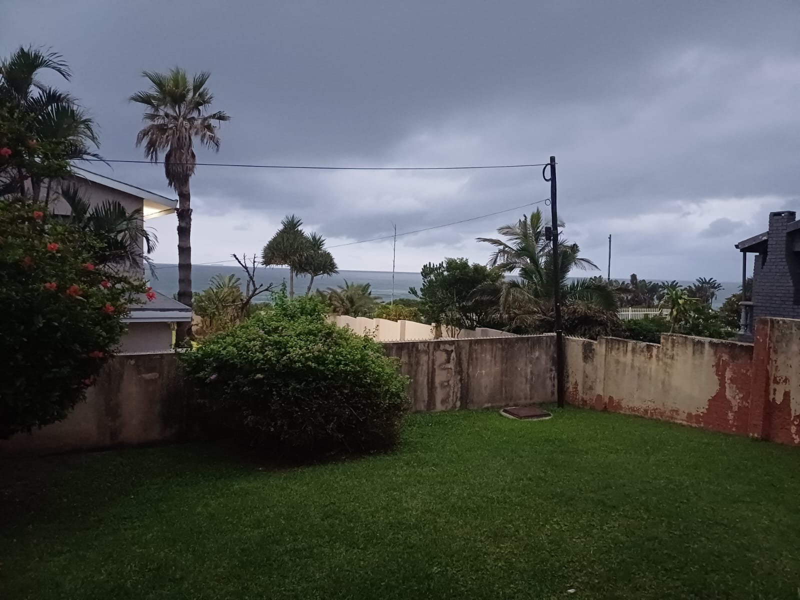
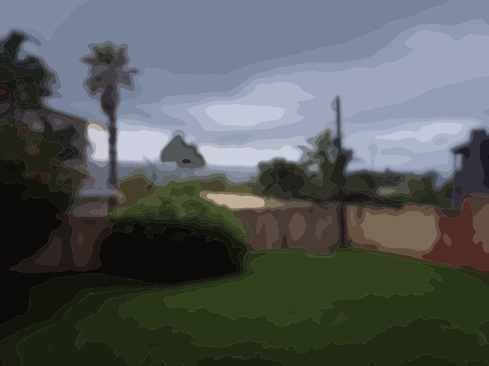

# Img2Num

 
_Img2Num_ converts raster images into clean SVGs with _high accuracy and performance_.

### Before vs After

| Original | Vectorized (SVG) |
|----------|------------------|
|  |  |
|  |  |
|  |  |

### What are you waiting for?

Try the [live demo](https://ryan-millard.github.io/Img2Num/)!

 
 
 

## Essential links

### Docs
- [Full documentation](https://ryan-millard.github.io/Img2Num/info/docs/next/)
- [C++](https://ryan-millard.github.io/Img2Num/info/docs/next/cpp/)
- [C](https://ryan-millard.github.io/Img2Num/info/docs/next/c/)
- [JavaScript](https://ryan-millard.github.io/Img2Num/info/docs/next/js/)
- [Internal docs](https://ryan-millard.github.io/Img2Num/info/docs/next/internal/) (for contributors)

### Community
- [Changelog](https://ryan-millard.github.io/Img2Num/info/changelog)
- [Contributing guide](https://github.com/Ryan-Millard/Img2Num/blob/main/CONTRIBUTING.md)
- [Issues](https://github.com/Ryan-Millard/Img2Num/issues)

### Deployments
- [Demo app (React)](https://ryan-millard.github.io/Img2Num/)
- [Docker Hub](https://hub.docker.com/repository/docker/ryanmillard/img2num-dev/general)

## Contributing

We'd love some help! Check out our [CONTRIBUTING.md](https://github.com/Ryan-Millard/Img2Num/blob/main/CONTRIBUTING.md).

## License Summary

This project is multi-licensed depending on component
- **MIT** — core packages, scripts, libraries, build tools, etc.
- **AGPLv3** — docs, example apps, CI/config.

See the [LICENSE](https://github.com/Ryan-Millard/Img2Num/blob/main/LICENSE) for the explanation.

## Can't find something?

If you need something, you should be able to find it on the [docs site](https://ryan-millard.github.io/Img2Num/info/docs/).
If it isn't there, feel free to open a ["New Feature" issue](https://github.com/Ryan-Millard/Img2Num/issues/new?template=feature_request.yml) 
to request its addition to the docs and someone will assist you with finding or creating what you need.

## Maintainers

| GitHub | Role |
|--------|------|
| [ `@Ryan-Millard`](https://github.com/Ryan-Millard) | Lead Maintainer |
| [ `@krasner`](https://github.com/krasner) | Core Maintainer |

## Contributors & Credits

Thanks to all of our contributors - your impact on this project has been greatly appreciated!

