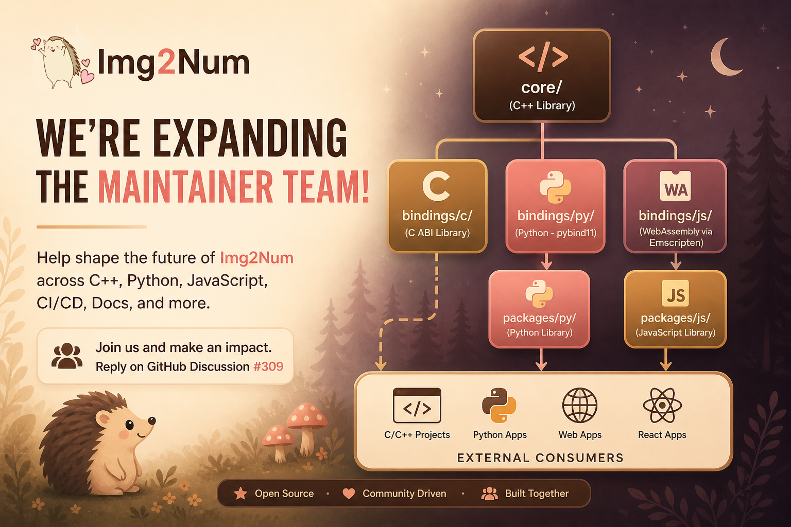
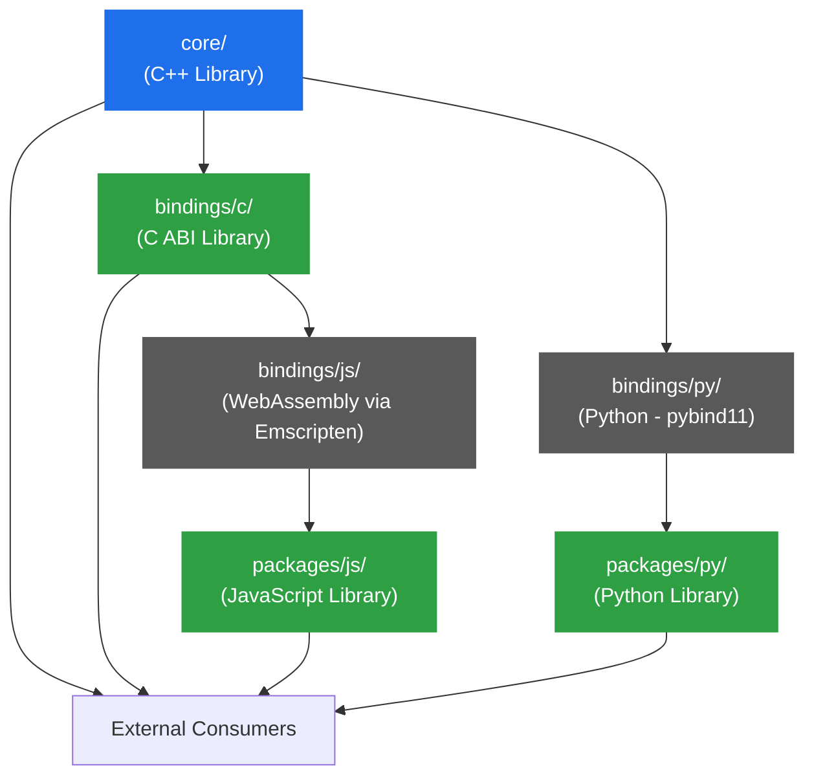
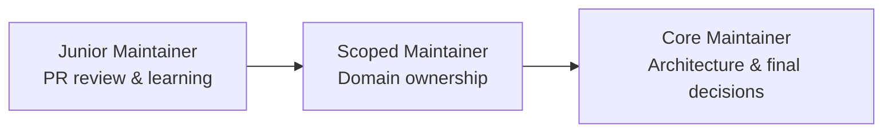

# We're Expanding the Maintainer Team

Img2Num has grown well past the point where one or two people can own it responsibly.

The codebase now spans a performance-critical C++ core, cross-language bindings (Python, JavaScript, C), a WebAssembly build pipeline, CI/CD automation, and a Docusaurus docs site. Keeping all of that high-quality and sustainable requires real ownership — not just occasional PRs.

We're looking for experienced contributors ready to take on scoped, ongoing responsibility.

{/* truncate */}

## Architecture Overview

Img2Num is a layered system. Here's how the pieces fit together:

| Layer              | Path           | Notes                                        |
| ------------------ | -------------- | -------------------------------------------- |
| C++ Core           | `core/`        | Source of truth for all algorithms           |
| C ABI              | `bindings/c/`  | Stable ABI boundary; feeds the Wasm pipeline |
| WebAssembly        | `bindings/js/` | Built via Emscripten from the C ABI          |
| JavaScript package | `packages/js/` | Safe runtime wrapper over the Wasm module    |
| Python bindings    | `bindings/py/` | pybind11 directly on the C++ core            |
| Python package     | `packages/py/` | Exposes the native Python module             |

## Open Maintainer Areas

### CI/CD

- GitHub Actions workflows, Docker builds, release pipelines, automated publishing.

### C ABI (`bindings/c`)

- Maintain the C ABI over the C++ core. Must stay compatible with external C consumers and the Wasm pipeline.

### JavaScript / WebAssembly (`bindings/js`, `packages/js`)

- Emscripten integration, browser and Node.js compatibility, pnpm workspace tooling, React example app.

### Python (`bindings/py`, `packages/py`)

- pybind11 bindings, uv workspace tooling, console example app.

### Docs & DX (`docs/`, `doxygen/`)

- Docusaurus site, Doxygen integration, tutorials, onboarding experience.

### Releases & Packaging

- Versioning, tagging, GitHub Releases, npm and Docker Hub publishing.

### Testing & Validation

- CI test coverage, linting/formatting enforcement, regression testing.

### Internal Tooling (`scripts/`)

- Cross-platform CLI utilities, developer automation, local workflow improvements.

## Maintainer Tiers

| Tier       | Merge Access        | Responsibilities                                                      |
| ---------- | ------------------- | --------------------------------------------------------------------- |
| **Junior** | None                | Review small PRs, contribute within a defined scope                   |
| **Scoped** | Within their domain | Own a specific area — review, approve, maintain quality               |
| **Core**   | Broad               | Cross-domain architecture, final merge authority, long-term direction |

Trust is earned through consistent contributions. Everyone starts scoped.

## How to Apply

Reply to [#309](https://github.com/Ryan-Millard/Img2Num/discussions/309) with:

- Which area(s) you want to own
- A short summary of relevant experience
- GitHub profile or projects (optional)

We'll follow up directly.
