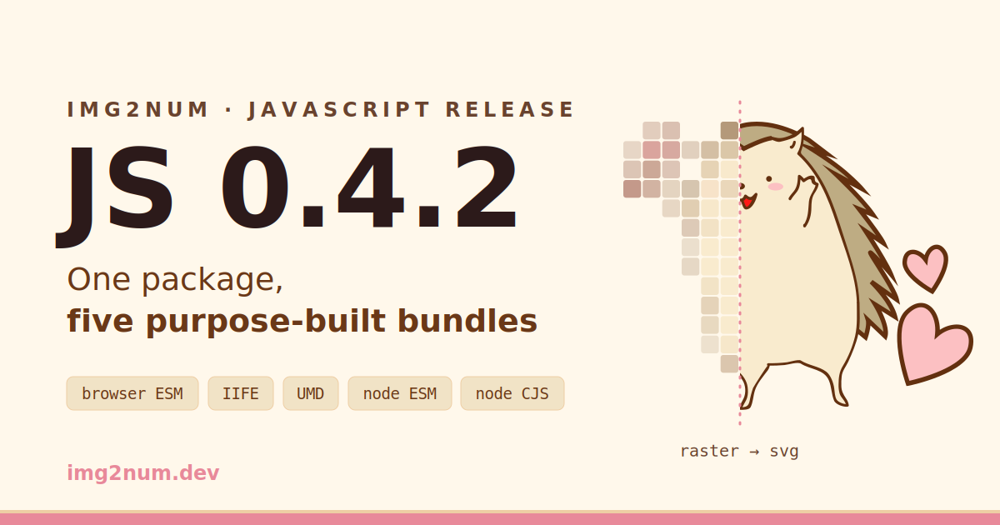

import Link from "@docusaurus/Link";
import Tabs from "@theme/Tabs";
import TabItem from "@theme/TabItem";



Img2Num's [JavaScript package v0.4.2](https://www.npmjs.com/package/img2num) is out on npm, and it's the biggest change to
the npm distribution since we first shipped WebAssembly builds.

In short, instead of one compromise bundle, the package now ships five purpose-built bundles,
each backed by its own Emscripten glue variant, and getting started no longer requires
knowing anything about Emscripten - regardless of whether you're in a bundled web app,
a plain `<script>` tag, or Node.js.

**If you're new here:** Img2Num is a C++-based library for converting raster images into clean SVGs, with bindings for C, Python, and JavaScript.
This release is about the [JavaScript](https://www.npmjs.com/package/img2num) and WebAssembly side of the library - the
[C++ core](https://github.com/Ryan-Millard/Img2Num/releases?q=cpp),
[C API](https://github.com/Ryan-Millard/Img2Num/releases?q=bindings-c), and
[Python package](https://pypi.org/project/img2num/) are unchanged.

{/* truncate */}

:::warning[Why 0.4.2 and not 0.4.0?]

Because our example apps kept catching bugs faster than we could write this post.

[**0.4.0**](https://www.npmjs.com/package/img2num/v/0.4.0) shipped everything described below - plus two latent bugs, one per environment.
In the browser, the published wasm URL wasn't statically detectable by bundlers, so bundled
apps (Vite, webpack, Rollup) hit a 404 on `img2num.wasm` at runtime. Our own React example
caught it the same day, and 0.4.0 is now [deprecated on npm](https://www.npmjs.com/package/img2num/v/0.4.0).

[**0.4.1**](https://www.npmjs.com/package/img2num/v/0.4.1) fixed the browser build - but CommonJS was still broken. `require("img2num")`
crashed on Node < 22.12 with `ERR_REQUIRE_ESM` instead of converting: our load of the
ESM-only [`webgpu`](https://www.npmjs.com/package/webgpu) package was compiled into a
top-level `require()` call, and when that failed, the promised CPU fallback died too -
the Emscripten glue dereferences `navigator`, which doesn't exist in Node, so the
conversion aborted with `navigator is not defined` instead of falling back. Node >= 22.12
supports `require()` of ES modules and masked all of this, which is exactly why our dev
machines never saw it. Our new Node CJS example caught it two days later.

[**0.4.2**](https://www.npmjs.com/package/img2num/v/0.4.2) is the release as intended, and it exists specifically to make CommonJS work:
the `webgpu` load is now a real dynamic `import()` in the CJS output, and the fallback
path installs a stub `navigator.gpu` so the glue genuinely routes to the CPU. Both bug
classes now have build-time guards that inspect the _emitted_ bundles and fail the build
if either regression ever reappears - because both times, the source was correct and the
published artifact wasn't.

:::

## Why we rebuilt the build

Until now, the npm package shipped a single Emscripten build that tried to work everywhere.
It mostly did - but "mostly" meant subtle path-resolution bugs when bundlers relocated the `.wasm` file,
awkward CJS/ESM interop in Node, and a `<script>`-tag story that was harder than it should have been (it was basically unusable).

The underlying problem is that one Emscripten glue _cannot_ serve every consumption mode.
ES6-style glue emits top-level `await` and `import.meta`, which UMD and IIFE chunks can't carry.
CJS-shaped glue reads `__dirname`, which ESM doesn't have. Web glue drags XHR branches into Node;
Node glue drags `fs`/`path` branches into the browser.
No single artifact can be all of these at once, so we stopped trying to make that idea work.

[0.4.2](https://github.com/Ryan-Millard/Img2Num/releases/tag/packages-js-v0.4.2)
builds three WASM variants (web, standalone (iife/umd), node) through a parameterized CMake function,
then emits five bundles from per-target Vite configs:

| Bundle                                                                                                          | Format | WASM             | Use case                                  |
| --------------------------------------------------------------------------------------------------------------- | ------ | ---------------- | ----------------------------------------- |
| [`dist/browser/img2num.js`](https://cdn.jsdelivr.net/npm/img2num@0.4.2/dist/browser/img2num.js)                 | ESM    | External `.wasm` | Bundled web apps (Vite, webpack, Rollup)  |
| [`dist/standalone/img2num.iife.js`](https://cdn.jsdelivr.net/npm/img2num@0.4.2/dist/standalone/img2num.iife.js) | IIFE   | Inlined          | Plain `<script>` tag, CDNs                |
| [`dist/standalone/img2num.umd.js`](https://cdn.jsdelivr.net/npm/img2num@0.4.2/dist/standalone/img2num.umd.js)   | UMD    | Inlined          | AMD/RequireJS and legacy loaders          |
| [`dist/node/img2num.js`](https://cdn.jsdelivr.net/npm/img2num@0.4.2/dist/node/img2num.js)                       | ESM    | External `.wasm` | Modern Node projects (`import`)           |
| [`dist/node/img2num.cjs`](https://cdn.jsdelivr.net/npm/img2num@0.4.2/dist/node/img2num.cjs)                     | CJS    | External `.wasm` | Existing CommonJS codebases (`require()`) |

Your package manager and bundler pick the right one automatically via the `exports` map -
you just `import { ... } from "img2num"` (or `require` it) and it'll work.

The WASM strategy differs by target on purpose.
The standalone IIFE/UMD builds inline the binary, so a `<script>` tag loads one file with no path resolution at all.
The browser ESM and Node builds ship a real sibling `.wasm` file that your bundler resolves and copies via `new URL(..., import.meta.url)` -
we had to actively defeat Vite's lib-mode habit of inlining it as a data URL, which cut the browser entry from ~900 kB to ~108 kB.
That tug-of-war is exactly what bit [0.4.0](https://www.npmjs.com/package/img2num/v/0.4.0): our anti-inlining trick also hid the URL from _your_ bundler.
[0.4.1](https://www.npmjs.com/package/img2num/v/0.4.1) fixed it by mangling the URL only during our build and restoring the bundler-detectable literal in the published output,
so both sides of the fight now win - and a build guard fails loudly if the literal ever goes missing again.

The Node builds fight a different interop battle - the one that forced [0.4.2](https://www.npmjs.com/package/img2num/v/0.4.2). The optional
GPU path loads the [`webgpu`](https://www.npmjs.com/package/webgpu) package, which is
ESM-only - so the CJS bundle has to load it with a dynamic `import()`, the one form of ESM
loading that works inside CommonJS everywhere. [0.4.0](https://www.npmjs.com/package/img2num/v/0.4.0) and [0.4.1](https://www.npmjs.com/package/img2num/v/0.4.1) shipped that as a
compiled-in `require()` (see the warning above); [0.4.2](https://www.npmjs.com/package/img2num/v/0.4.2) ships the real `import()`, and if
`webgpu` is missing or fails to load for any reason, Img2Num now installs a stub
`navigator.gpu` so the WASM glue genuinely falls back to the CPU instead of crashing on
`navigator is not defined`. A matching build guard scans the emitted CJS chunk and fails
the build if any executable `require("webgpu")` ever sneaks back in.

## How to use Img2Num in the browser and Node.js

The same two calls - decode to pixels, convert to SVG - work in every environment.
Here's the shortest working version of each target, with a live sandbox to poke at:

<Tabs groupId="js-target">
<TabItem value="browser-esm" label="Browser ESM" default>

For bundled apps (Vite, webpack, Rollup) or a native `<script type="module">` - the `exports` map resolves the browser build automatically:

```js
import { imageToUint8ClampedArray, imageToSvg } from "img2num";

const fileInput = document.querySelector("#fileInput");

fileInput.addEventListener("change", async (e) => {
  const { pixels, width, height } = await imageToUint8ClampedArray(e.target.files[0]);
  const { svg } = await imageToSvg({ pixels, width, height });

  document.querySelector("#preview").src = "data:image/svg+xml;base64," + btoa(svg);
});
```

**[Try it on CodeSandbox](https://codesandbox.io/p/sandbox/delicate-bird-3kprj2)**

</TabItem>
<TabItem value="iife" label="IIFE">

One plain `<script>` tag, one global `Img2Num` object - the WASM is inlined, so there's nothing else to serve:

```html
<script src="https://cdn.jsdelivr.net/npm/img2num@0.4.2/dist/standalone/img2num.iife.js"></script>
<script>
  const { imageToUint8ClampedArray, imageToSvg } = Img2Num;

  fileInput.addEventListener("change", async (e) => {
    const { pixels, width, height } = await imageToUint8ClampedArray(e.target.files[0]);
    const { svg } = await imageToSvg({ pixels, width, height });
    preview.src = "data:image/svg+xml;base64," + btoa(svg);
  });
</script>
```

**[Try it on CodeSandbox](https://codesandbox.io/p/sandbox/iife-fh25gg)**

</TabItem>
<TabItem value="umd" label="UMD (RequireJS)">

Loaded as an AMD module - nothing is added to the global scope:

```html
<script src="https://cdn.jsdelivr.net/npm/requirejs@2.3.8/require.js"></script>
<script>
  requirejs.config({
    paths: { img2num: "https://cdn.jsdelivr.net/npm/img2num@0.4.2/dist/standalone/img2num.umd" },
  });

  requirejs(["img2num"], ({ imageToUint8ClampedArray, imageToSvg }) => {
    fileInput.addEventListener("change", async (e) => {
      const { pixels, width, height } = await imageToUint8ClampedArray(e.target.files[0]);
      const { svg } = await imageToSvg({ pixels, width, height });
      preview.src = "data:image/svg+xml;base64," + btoa(svg);
    });
  });
</script>
```

**[Try it on CodeSandbox](https://codesandbox.io/p/sandbox/competent-shape-2drsrz)**

</TabItem>
<TabItem value="node-esm" label="Node ESM">

`import` resolves the Node ESM build. Decode with whatever you like - here, [sharp](https://www.npmjs.com/package/sharp):

```js
import { writeFileSync } from "fs";
import { imageToSvg, terminateWasmModule } from "img2num";
import sharp from "sharp";

const { data, info } = await sharp("input.png").ensureAlpha().raw().toBuffer({ resolveWithObject: true });

const pixels = new Uint8ClampedArray(data.buffer, data.byteOffset, data.byteLength);

try {
  const { svg } = await imageToSvg({ pixels, width: info.width, height: info.height });
  writeFileSync("output.svg", svg);
} finally {
  await terminateWasmModule();
}
```

**[Try it on CodeSandbox](https://codesandbox.io/p/devbox/node-esm-jmn444)**

</TabItem>
<TabItem value="node-cjs" label="Node CJS">

`require()` resolves the CJS build - the one this release exists to fix. No flags, no interop wrappers:

```js
const { writeFileSync } = require("fs");
const { imageToSvg, terminateWasmModule } = require("img2num");
const sharp = require("sharp");

async function main() {
  const { data, info } = await sharp("input.png").ensureAlpha().raw().toBuffer({ resolveWithObject: true });

  const pixels = new Uint8ClampedArray(data.buffer, data.byteOffset, data.byteLength);

  try {
    const { svg } = await imageToSvg({ pixels, width: info.width, height: info.height });
    writeFileSync("output.svg", svg);
  } finally {
    await terminateWasmModule();
  }
}

main().catch(console.error);
```

**[Try it on CodeSandbox](https://codesandbox.io/p/devbox/node-cjs-dp5ltr)**

</TabItem>
</Tabs>

## Breaking changes

This is a majorish release for a reason, though migration is small for most codebases:

:::danger[`dist/` layout and filenames have changed.]

- If you were deep-importing into `dist/`, update those paths to the table above.
- If you import the package root, you don't have to change anything.

:::

:::danger[Export conditions are reordered.]

The `browser` condition now comes first, so bundlers targeting the browser actually get the browser build -
previously they matched `import` first and silently received the Node build.
If your bundle got smaller and your weird workaround stopped being necessary, that's why.

:::

:::danger[Minimum supported Node is now v18.]

Previously we documented Node >= 14; the new node-glue builds require version 18.

:::

:::note[Other Improvements]

Two quieter improvements ride along:

1. The optional `webgpu` dependency in Node is now properly guarded:
   if it's missing (`--ignore-optional`), fails to install on your platform, or can't
   be loaded, Img2Num logs a warning and falls back to CPU instead of throwing.
   (0.4.0 and 0.4.1 claimed this and didn't deliver it - the fallback path itself crashed.
   0.4.2 delivers it, verified against both the ESM and CJS console examples with
   `webgpu` removed.)

2. Initial WASM memory **dropped from 2 GB to 32 MB** - a 2 GB
   reservation fails outright on mobile Safari and bought nothing with memory growth enabled.

:::

## What about the synchronous API?

That was last release.
[0.3.0](https://www.npmjs.com/package/img2num/v/0.3.0) removed the internal Web Worker and made the API fully synchronous -
Img2Num does the math, you decide where it runs.
If you're moving from an earlier version straight to [v0.4.2](https://www.npmjs.com/package/img2num),
the [0.3.0](https://www.npmjs.com/package/img2num/v/0.3.0)
migration still applies: delete the `await`, and wrap calls in your own worker if you need to keep the main thread free:

```js
// worker.js
import { process } from "img2num";
self.onmessage = ({ data }) => {
  self.postMessage(process(data.imageData, data.options));
};
```

[v0.4.2](https://www.npmjs.com/package/img2num) is what that change unlocked:
with no worker plumbing forced into every artifact, each target could finally get a build shaped for its actual environment.

:::tip[Why did [0.3.0](https://www.npmjs.com/package/img2num/v/0.3.0) remove the workers?]

Cross-environment compatibility. A hidden worker only made sense in some targets, and it
fought any worker architecture you already had. Running synchronously works everywhere -
Img2Num does the math, and you decide which thread it runs on.

:::

## Example apps for every binding

Talking about build targets is abstract, so the examples got a matching overhaul:

- `console-js` is now split into <a href="/example-apps/#node-esm"><code>console-js-esm</code></a> and <a href="/example-apps/#node-cjs"><code>console-js-cjs</code></a>,
  so the `import` and `require` export conditions are each exercised by a real consumer (and we fixed a byte-offset bug in the pixel-buffer construction while we were in there).
- The `html-js` example was rebuilt as a single shared template compiled into three self-contained variants -
  <Link to="/example-apps/esm/" target="_blank">
    ESM
  </Link>
  &comma;&nbsp;
  <Link to="/example-apps/iife/" target="_blank">
    IIFE
  </Link>
  &comma; and&nbsp;
  <Link to="/example-apps/umd/" target="_blank">
    UMD
  </Link>
  &nbsp;- each deployable as plain static files with no build tooling at runtime.
- The docs site now has an [example apps index](https://img2num.dev/example-apps/) with a card and representative snippet for every binding:
  React, browser ESM, IIFE, UMD, Node ESM/CJS - and Python, C++, and C, because Img2Num was never just a JavaScript library.
- Every JS target is also runnable in your browser right now - the CodeSandbox links in the
  [tabs above](#using-the-new-bundles) are one click from "processed image" with nothing installed.

Each example is intentionally minimal: the shortest path from "empty directory" to "processed image" in your environment of choice.
They're also our first line of defense - and this release proved it twice.
The React example caught the 0.4.0 browser bug before almost anyone could hit it,
and the new Node CJS example caught the CommonJS bug that survived into 0.4.1 the same way.
Every entry point now has a real consumer that runs it the way you would.

## Getting started

```bash title="Using npm"
npm install img2num
```

```html title="Using a CDN (the CDN default resolves to the single-file IIFE build)"
<script src="https://cdn.jsdelivr.net/npm/img2num@0.4.2/dist/standalone/img2num.iife.js"></script>
```

(Pin the version - your future self will thank you.)

## What's next

Purpose-built targets give us a clean baseline for the work we've wanted to do for a while:
benchmarking across environments and exploring WebGPU acceleration beyond the current optional Node support.
If you hit anything odd with the new builds - an environment we didn't test, an interop edge case -
please [open an issue](https://github.com/Ryan-Millard/Img2Num/issues) so we can fix it for you.
Reports from real setups are exactly what a release like this needs.

Thanks for using Img2Num! 🦔🦔
