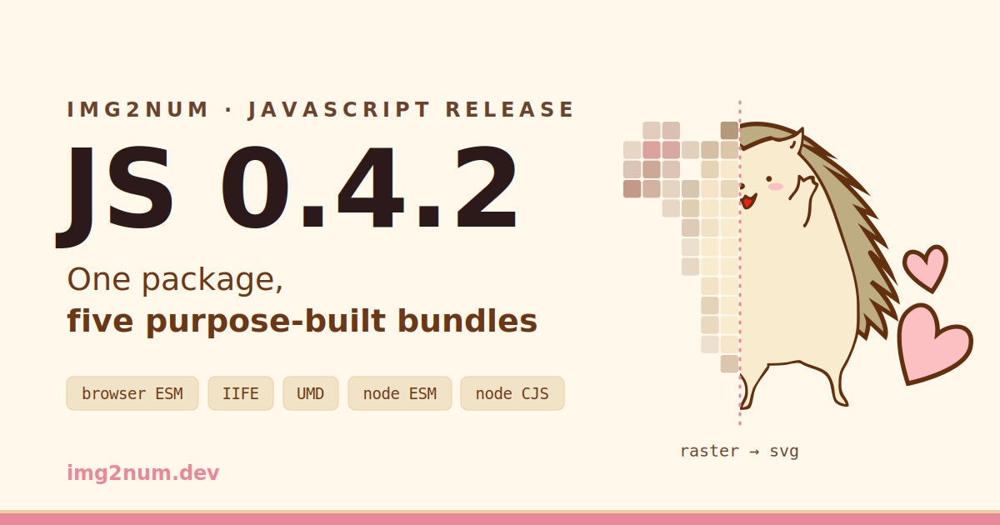

We are thrilled to announce that **Img2Num is participating in [Hacktoberfest 2026](https://hacktoberfest.com/)!**

Whether you're a seasoned open source contributor or someone making their very first pull request, we'd love to have you join us this October.

{/* truncate */}

## What is Hacktoberfest?

Hacktoberfest is an annual month-long celebration of open source software, run every October by DigitalOcean. It encourages developers of all skill levels to contribute to open source projects by submitting pull requests.

This year's theme is **AI is for Everyone**, a recognition that meaningful contribution to AI and machine learning projects isn't reserved for researchers or senior engineers. If you can write a sentence of documentation, fix a typo, improve a test, or add a feature, you are contributing to AI. And that matters.

A single well-thought-out contribution that improves the project meaningfully is worth far more than ten low-effort ones.

## Why contribute to Img2Num?

Img2Num is a fast, accurate raster-to-SVG vectorization library with bindings for C++, C, Python, and JavaScript. It is actively used, actively maintained, and actively growing.

Here's what contributing to Img2Num gives **you**:

- **Real experience**. You'll work with C++, WebAssembly, Python bindings, React, and Docusaurus. These are real technologies used in production.

- **CV/resume material**. Open source contributions are one of the best ways to demonstrate your skills to future employers. A merged PR in a real project is worth more than most personal projects.

- **Mentorship**. We actively mentor newcomers. You will not be left alone to figure things out. We review PRs carefully and explain our feedback.

- **Long-term community**. Hacktoberfest is just the start. Several of our current maintainers began as Hacktoberfest contributors.

And here's what your contributions give **us**:

- More work done. The project moves faster with more hands.

- Fresh perspectives. Newcomers often spot things that long-time contributors overlook.

- Long-term contributors. Some of the best team members started as first-timers.

## New to open source? We've got you covered.

If this is your first time exploring open source, you might be wondering where to even begin.

We know exactly how difficult and confusing it can feel when you start contributing to open source. There are unfamiliar repositories, contribution guidelines, issues, pull requests, branches, reviews, and a lot of new terminology to figure out. Your first contribution can feel much more complicated than it actually is.

That's why we've created a bunch of **Good First Issues specifically for newcomers**. You don't need to be an open source expert to get started, and you don't need to know everything before making your first contribution.

Start with an issue that interests you, read the contributing guide, and ask questions whenever you're stuck. We'll help you understand the project and the contribution process along the way.

And don't worry if your first contribution is something small. Fixing documentation, improving an example, adding a test, fixing a typo, or making a small improvement is still a real contribution.

**If you're new to open source, we've got you covered. 🦔**

Check out our [Good First Issues](https://github.com/Ryan-Millard/Img2Num/issues?q=is%3Aopen+label%3A%22good+first+issue%22) and find something that feels approachable.

## Beyond Img2Num

While you're in the open source spirit, we'd also encourage you to look beyond Img2Num.

Img2Num is built on top of and alongside several amazing open source projects. These projects provide important building blocks and baseline functionality that help make Img2Num possible.

If you enjoy working on Img2Num, you might also find something interesting to contribute to in the projects we depend on:

- [**Dawn**](https://dawn.googlesource.com/dawn). Google's WebGPU implementation, which powers our GPU acceleration.

- [**spdlog**](https://github.com/gabime/spdlog). The fast C++ logging library we use.

- [**STB**](https://github.com/nothings/stb). Single-file C libraries used in our example apps.

- [**OpenCV**](https://github.com/opencv/opencv). Used in our Python example app.

- [**Docusaurus**](https://github.com/facebook/docusaurus). The framework that powers our documentation site.

These projects are part of the open source ecosystem that Img2Num is built with and around. They have their own issues, documentation, tests, features, and communities that can benefit from new contributors too.

So if you find yourself thinking, "I want to contribute to open source, but maybe Img2Num isn't the right project for me," that's completely fine.

Explore these projects, find something that interests you, and make your first contribution there.

Every contribution to any open source project makes the ecosystem better for everyone.

## See you in October 🦔

We're excited to meet you. Whether you fix a typo or implement a feature, your contribution matters.

Come say hello in [Discussions](https://github.com/Ryan-Millard/Img2Num/discussions), pick up an issue, and let's build something great together.