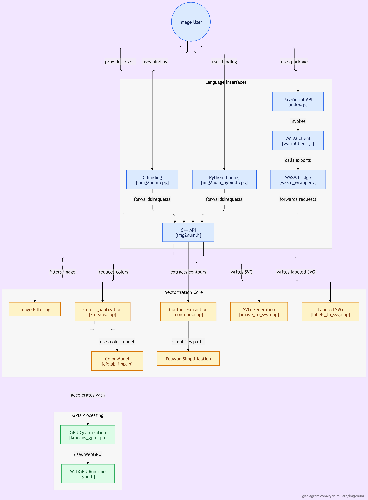

# Explanation of the In-depth Data Flow in Img2Num

## Overview

Img2Num is a tool to transform raster images into Scalable Vector Graphics format. Rather than handling the image as a set of pixels, Img2Num processes the image in order to divide it into regions, traces their borders, and produces SVG paths representing the regions.

The core image processing algorithm is written in C++. The other programming languages bindings are built on top of the core in order to share the same processing flow among multiple programming languages.

{/* truncate */}

## For Beginners

At a high level, the conversion follows this process:

```text
Raster Image
     ↓
Color Quantization
     ↓
Color Labels
     ↓
Contour Tracing
     ↓
Contour Smoothing
     ↓
SVG Path Generation
     ↓
SVG Output
```

In color quantization, the number of colors in an image is reduced. Img2Num implements K-Means clustering technique for grouping pixels with similarities to form representative colors.

Contour tracing will be used for finding the boundaries of the regions formed. The boundaries found may be further processed into path representations that may be converted to SVG.

The main idea here is that these processes occur in the core implemented using C++. The other layers just offer interfaces from various programming environments to the core.

## 1. C++ Core

Core of C++ is the main component of Img2Num that actually implements the image processing algorithm and has no dependencies on Python and JavaScript.

The following is the public C++ API for the conversion method:

`img2num::image_to_svg(...)`

It takes image data and parameters and returns the resulting SVG string.

At a high level, the processing involves:

```text
Image Data
    ↓
Image Processing 
    ↓
K-Means Color Quantization
    ↓
Region Labels
    ↓
Contour Processing
    ↓
SVG Generation
```

Pixels are organized into clusters by the K-Means step. Labels generated by this procedure specify to which cluster each individual pixel pertains.

Boundaries of regions identified by such labels are detected using the contour processing step. Contour smoothing is applied before creating SVG paths in the Img2Num tool.

The critical distinction is:

> C++ core: executes all image processing.

> Bindings: give access to C++ functionality from other programming languages.

## 2. C Bindings

The C bindings act as a thin wrapper between the C++ code and the C-based API requirements.

C++ has several facilities like classes, namespaces, function overloading, etc., which are not supported in C's ABI. The C binding layer helps to expose certain facilities in a C-compatible interface.

Some examples of C-based interface functions are:

`img2num_image_to_svg(...)`

The flow is conceptually like this:

```text
 C Application
     ↓
  C Binding
     ↓
  C++ Core
     ↓
    SVG
```

C bindings thus cannot be considered a secondary implementation of image processing. Rather, they serve as an interface for the existing core developed using C++ language.

## 3. Python Bindings

Python takes another approach compared to JavaScript.

The Python bindings are built using pybind11 and communicate directly with the C++ core.

```text
 Python
   ↓
pybind11
   ↓
C++ Core
   ↓
  SVG
```

For instance, using Python, we have the following command:

`img2num.image_to_svg(image)`

The NumPy image array can be input into the binding layer and linked to the C++ implementation.

Contrary to the JavaScript implementation, there is no need for going through WebAssembly or C bindings for Python.

Therefore, this approach ensures that the Python API stays closer to the native C++ implementation.

## 4. WebAssembly

WebAssembly (WASM) provides the ability to run the Img2Num C++ features in various environments like web browsers and Node.js.

The WebAssembly layer takes a different path:

```text
C++ Core
   ↓
C Bindings
   ↓
Emscripten
   ↓
WebAssembly
```

The Emscripten build uses the C bindings as its interface to the C++ core. This is a project choice, not a WebAssembly limitation: Emscripten's Embind can expose registered C++ functions and classes to JavaScript. The full C++ API is not exported automatically; it requires explicit bindings.

The key architecture here is:

```text
C++ Core
    ↓
C Bindings
    ↓
WebAssembly
```

## 5. JavaScript

The JavaScript API wraps the WebAssembly API in an interface suitable for calling from JavaScript.

The JavaScript program can invoke functions like:

```text
imageToSvg({
  pixels,
  width,
  height
})
```

The high-level flow is:

```text
JavaScript
    ↓
JavaScript Wrapper
    ↓
WebAssembly
    ↓
C Bindings
    ↓
C++ Core
    ↓
   SVG
```

There is no requirement for the JavaScript programmer to explicitly control the C++ implementation, this is taken care of by the JavaScript wrapper. It communicates with the WebAssembly module and provides a handy API for its use.

In both cases, the same image-processing algorithms implemented in C++ can be used.

# Architecture Overview

The entire architecture can be summarized as:
```text
     ┌──────────────────┐
     │    C++ Core      │ 
     └────────┬─────────┘
              │
     ┌────────┴────────┐
     │                 │
 C Bindings            |
     │                 │
Emscripten          pybind11
     │                 │
WebAssembly            │
     │                 │
 JavaScript          Python
```

So, there are two main routes to the core:

```text
JavaScript
    ↓
JavaScript Wrapper
    ↓
WebAssembly
    ↓
C Bindings
    ↓
C++ Core
```

and:

```text
Python
    ↓
pybind11
    ↓
C++ Core
```

One Route for One Image in the System
Assume there is a JavaScript application that calls:

```text
imageToSvg({
  pixels,
  width,
  height
})
```
Image data is sent to the JavaScript wrapper that talks to the WebAssembly module exporting the C-compatible interface.

The C binding transfers this request further to the C++ core.

In the core, the image goes through the vectorization pipeline:

```text
Pixels
  ↓
Color Quantization
  ↓
Region Labels
  ↓
Contour Tracing
  ↓
Contour Smoothing
  ↓
SVG Path Generation
  ↓
SVG String
```

This SVG string will then travel up again through all these levels of interface until it reaches back to the JavaScript application.

Python follows the same underlying C++ processing logic, but its path is shorter:

```text
Python
  ↓
pybind11
  ↓
C++ Core
  ↓
SVG String
```

This layered architecture allows Img2Num to maintain one central image processing implementation while supporting multiple programming environments.

[Read the documentation here](https://github.com/Ryan-Millard/Img2Num/blob/main/README.md)
