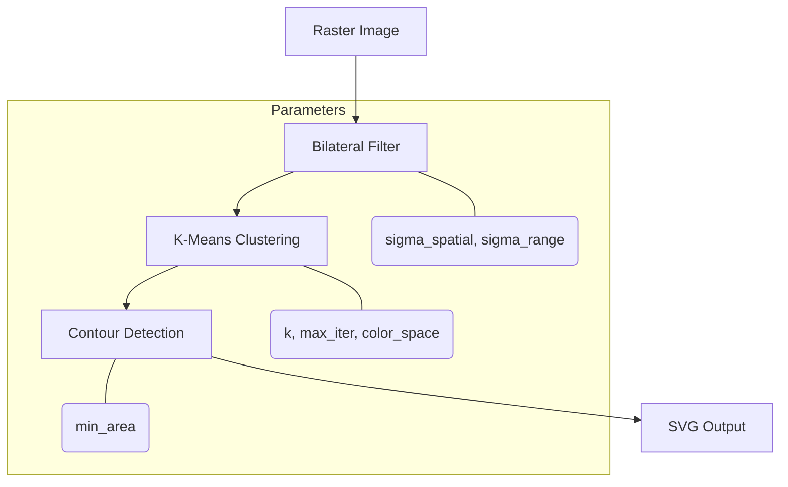

# API Reference Overview

Img2Num provides bindings for multiple languages. Choose the one that fits your workflow:

| Language       | Docs                                                      |
| :------------- | :-------------------------------------------------------- |
| **JavaScript** | [JS API Reference](/docs/js/js-api-reference)             |
| **C++**        | [C++ API Reference](/docs/cpp/cpp-api-reference)          |
| **C**          | [C API Reference](/docs/c/c-api-reference)                |
| **Python**     | [Python API Reference](/docs/python/python-api-reference) |

## Common Concepts Across All Bindings

All APIs share these core concepts:

1. **Bilateral Filtering** — Smooths noise while preserving edges.
2. **K-Means Clustering** — Reduces the palette to `k` representative colors.
3. **Contour Tracing** — Detects boundaries between color clusters.
4. **B-spline Simplification** — Fits smooth quadratic curves to contours.

## Shared Parameters

| Parameter          | Type    | Default | Description               |
| :----------------- | :------ | :------ | :------------------------ |
| `sigma_spatial`    | `float` | `3`     | Bilateral spatial sigma   |
| `sigma_range`      | `float` | `50`    | Bilateral range sigma     |
| `num_colors` / `k` | `int`   | `16`    | Number of clusters        |
| `max_iter`         | `int`   | `100`   | K-means iterations        |
| `min_area`         | `int`   | `100`   | Minimum contour area      |
| `color_space`      | `int`   | `0`     | `0` = CIE LAB, `1` = sRGB |

## Pipeline Flow

