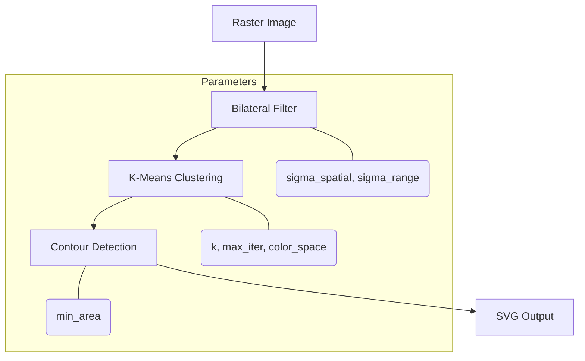

# API Reference Overview

Img2Num provides bindings for multiple languages. Choose the one that fits your workflow:

| Language              | Docs                                                      |
| --------------------: | :------------ |
|  | [JS API Reference](../js)             |
|  | [C++ API Reference](../cpp)          |
|  | [C API Reference](../c)           |
|  | [Python API Reference](../py) |

## Common Concepts Across All Bindings

All APIs share these core concepts:

1. **Bilateral Filtering** — Smooths noise while preserving edges.
2. **K-Means Clustering** — Reduces the palette to `k` representative colors.
3. **Contour Tracing** — Detects boundaries between color clusters.
4. **B-spline Simplification** — Fits smooth quadratic curves to contours.

## Shared Parameters

| Parameter                      | Type    | Default | Description               |
| -----------------------------: | :------ | :------ | :------------------------ |
| `sigma_spatial` ($\sigma_{s}$) | `float` | `3`     | Bilateral spatial sigma   |
| `sigma_range` ($\sigma_{r}$)   | `float` | `50`    | Bilateral range sigma     |
| `num_colors` / `k` ($k$)       | `int`   | `16`    | Number of clusters        |
| `max_iter`                     | `int`   | `100`   | K-means iterations        |
| `min_area`                     | `int`   | `100`   | Minimum contour area      |
| `color_space`                  | `int`   | `0`     | `0` = CIE LAB, `1` = sRGB |

## Pipeline Flow

