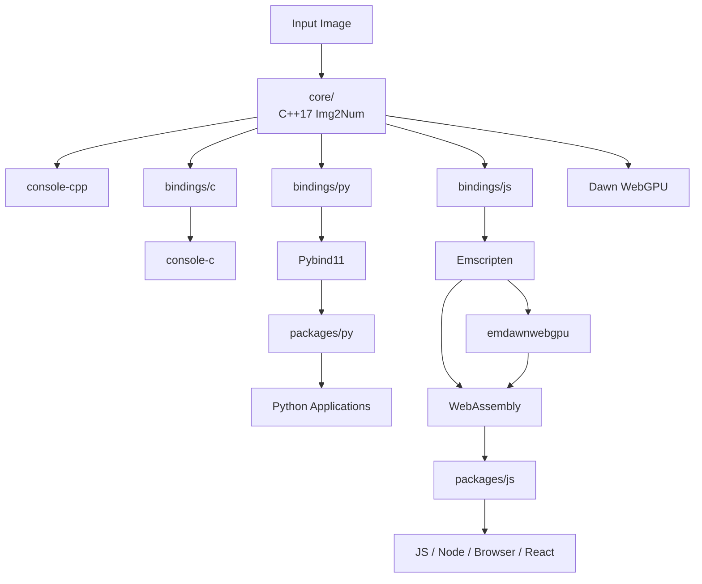

# Architecture Overview

Img2Num is organized around a native C++17 core with language bindings, distributable packages, and example applications. Understanding how these components connect can help contributors quickly find the part of the repository relevant to an issue.

## Architecture

The `core/` directory contains the native C++17 `Img2Num` library and its WebGPU implementation through Dawn. The C binding in `bindings/c` provides a C-compatible interface over the core library and is also used as the foundation for WebAssembly builds.

The JavaScript binding in `bindings/js` is compiled with Emscripten. Emscripten uses the `emdawnwebgpu` port to provide Dawn WebGPU support and produces WebAssembly artifacts consumed by `packages/js`. These packages are used by the JavaScript, Node.js, browser, and React examples.

The Python binding in `bindings/py` uses Pybind11 to expose the C++ core as a Python extension, which is packaged under `packages/py` for Python applications.

Native C++ examples can use the core library directly, while C examples use the C binding.