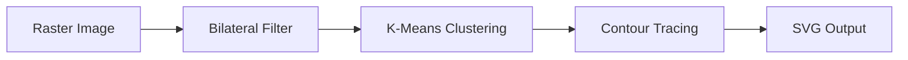

# Getting Started

This guide walks you through your first Img2Num conversion in under 5 minutes.

## Prerequisites

- A raster image (PNG, JPG, BMP, etc.)
- Node.js 14+ or a modern browser with ES module support

## Step 1 — Install the package

```bash
npm install img2num
```

## Step 2 — Convert an image to SVG

```js
import {
  imageToUint8ClampedArray,
  bilateralFilter,
  kmeans,
  findContours
} from "img2num";

// Load your image into RGBA pixels.
// Browser: imageToUint8ClampedArray decodes a File/Blob from an <input>.
// Node.js: decode with a library such as `sharp` (see the JavaScript guide) —
//          imageToUint8ClampedArray is browser-only.
const imageFile = /* File object, e.g. input.files[0] */;
const { pixels, width, height } = await imageToUint8ClampedArray(imageFile);

// Optional: denoise with bilateral filter
const filtered = await bilateralFilter({ pixels, width, height });

// Reduce palette to 16 colors
const { labels } = await kmeans({
  pixels: filtered,
  width,
  height,
  num_colors: 16,
});

// Convert to SVG
const { svg } = await findContours({
  pixels: filtered,
  labels,
  width,
  height,
});

// Use the SVG string
console.log(svg);
```

## Quick-start: One-liner with `imageToSvg`

Img2Num also provides a convenience wrapper that chains filtering, clustering, and contour detection:

```js
import { imageToSvg } from "img2num";

const { svg } = await imageToSvg({ pixels, width, height });
```

## What happens under the hood?



1. **Bilateral Filter** — smooths noise while preserving edges.
2. **K-Means Clustering** — reduces the palette to a configurable color count.
3. **Contour Tracing** — detects region boundaries and fits them to quadratic B-splines.

## Next steps

- [Concepts](/docs/concepts) — learn about color spaces, filtering, and contours.
- [API Reference](/docs/api-reference) — full parameter documentation.
- [Performance](/docs/performance) — tips for speeding up your pipeline.
