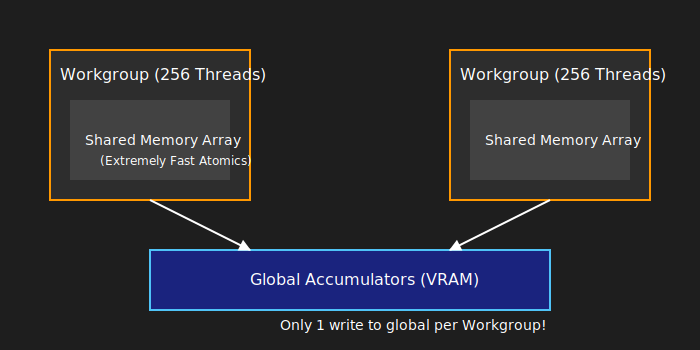

# WebGPU Compute Fundamentals & Algorithm Implementations

## Part 1: WebGPU Fundamentals

WebGPU is an explicit graphics and compute API. Unlike older APIs (like OpenGL) that hid memory management and scheduling behind a "black box" driver, WebGPU forces the developer to declare exactly what data goes where and when.

For a compute-focused application, you only need to understand the **Compute Pipeline**.

### 1. The Hardware Hierarchy

WebGPU maps your code to the physical GPU using a strict hierarchy of objects:

* **Instance:** The connection to the host OS and the WebGPU implementation (Google Dawn).
* **Adapter:** A physical piece of hardware (e.g., "NVIDIA RTX 4090" or "Apple M2").
* **Device:** The logical connection to the Adapter. You use the Device to create buffers, textures, and shaders.
* **Queue:** The actual submission line. You record commands on the CPU and push them into the Queue for the GPU to execute asynchronously.

### 2. The Execution Hierarchy (Workgroups)

When you dispatch a compute shader, the GPU does not run it on a single thread. It spawns thousands of threads in a structured grid.

* **Grid:** The total amount of work (e.g., calculating 1 pixel for a 1920x1080 image).
* **Workgroup:** A localized block of threads (e.g., 16x16 threads). Threads inside the same workgroup can share memory and synchronize using barriers.
* **Invocation (Thread):** A single execution of your `main()` function.


### 3. Memory & Bind Groups

Shaders cannot magically access CPU variables. You must explicitly bind memory:

* **Buffers:** Raw arrays of bytes (`wgpu::Buffer`). Used for uniform variables (params) or large data arrays (storage).
* **Textures:** Optimized grids of pixels (`wgpu::Texture`).
* **Bind Groups:** A specific layout mapping your C++ buffers/textures to the `@binding(X)` slots in your WGSL (WebGPU Shading Language) code.

---

## Part 2: The GPU Manager (`gpu.h`)

To prevent the nightmare of passing `wgpu::Device` and `wgpu::Queue` to every function in your codebase, the `GPU` class utilizes the **Singleton Pattern**.

```cpp
static GPU& getClassInstance() {
    static GPU gpuInstance;
    return gpuInstance;
}

```

**Why this matters:** Only one instance of the WebGPU context exists. Any file can include `gpu.h` and call `GPU::getClassInstance().get_device()` to allocate memory or compile shaders.

The `init_gpu()` function handles the asynchronous handshake with the browser or OS:

1. Requests the **Adapter** (Hardware).
2. Requests the **Device** (Logical connection).
3. Extracts the **Queue** (Submission line).
*Note: The `emscripten_sleep(10)` loop is required in WebAssembly builds to yield the main thread back to the browser so the JavaScript promises resolving the WebGPU hardware can actually fire.*

---

## Part 3: Algorithm Implementations

### 1. Color Space Conversion (RGB $\leftrightarrow$ CIELAB)

**Files:** `rgb2cielab.wgsl`, `cielab2rgb.wgsl`

Standard RGB is not perceptually uniform (a mathematical distance of 10 in RGB green does not look the same to the human eye as a distance of 10 in RGB blue). CIELAB ($L^*a^*b^*$) solves this, making it critical for accurate Bilateral Filtering and K-Means clustering.

* **$L^*$ (Lightness):** 0.0 to 100.0
* **$a^*$ (Green-Red):** Negative to Positive floats.
* **$b^*$ (Blue-Yellow):** Negative to Positive floats.

**GPU Implementation Details:**
Because LAB requires negative numbers and values exceeding 1.0, the output texture **must** be a 32-bit float texture (`texture_storage_2d<rgba32float, write>`). If you attempted to store this in a standard 8-bit image (`rgba8unorm`), the data would clip between 0.0 and 1.0, destroying the LAB values.

### 2. Bilateral Filter

**Files:** `bilateral_filter_rgb.wgsl`, `bilateral_filter_lab.wgsl`

A standard Gaussian blur blurs everything, destroying sharp edges. A Bilateral Filter is an "edge-preserving blur". It looks at two weights for every neighbor pixel:

1. **Spatial Weight ($w_s$):** How far away is the neighbor? (Closer = higher weight).
2. **Range Weight ($w_r$):** How similar is the color? (Similar color = higher weight).

If a neighboring pixel is close physically but a completely different color (i.e., it is across an edge), the range weight drops to nearly 0, preventing the colors from bleeding together.

**WGSL Math:**


$$w = \exp\left(-\frac{distSq}{2\sigma_{spatial}^2}\right) \times \exp\left(-\frac{rangeSq}{2\sigma_{range}^2}\right)$$

**Performance Warning:** The kernel radius is dynamically determined by `i32(3.0 * params.sigmaSpatial)`. A larger spatial sigma results in an exponentially larger $O(N^2)$ nested loop per pixel.

**Diagram**


### 3. K-Means Clustering (Advanced GPGPU)

K-Means groups pixels into $K$ distinct color clusters. It is an iterative algorithm:

1. Find the closest centroid for each pixel.
2. Average all pixels belonging to that centroid to find the new center.
3. Repeat.

#### The Naive Approach vs. The Atomic Bottleneck

A naive GPU implementation (`assign_shader.wgsl` + `update_shader.wgsl`) forces millions of threads to write to the exact same $K$ global memory slots simultaneously using `atomicAdd`.
This creates **Atomic Contention**. The GPU hardware physically locks the memory address, forcing thousands of parallel cores to wait in a single-file line, tanking performance.

#### The Optimized Approach (`assign_update_shader.wgsl`)

To bypass atomic contention, this shader introduces **Workgroup Shared Memory** (`var<workgroup>`).



**How it works:**

1. The shader allocates a small, blazing-fast array (`local_sumR`, etc.) strictly for the 256 threads in the current block.
2. `workgroupBarrier()` ensures all threads wait until the first few threads have zeroed out this memory.
3. Each thread calculates its distance, and does an `atomicAdd` to the **local** array. Because only 256 threads are fighting for access (instead of 2,000,000), it is nearly instantaneous.
4. Another `workgroupBarrier()` ensures all 256 threads are done doing math.
5. Finally, a single thread per cluster takes the sum of the entire local block and performs **one** `atomicAdd` to the global `accumulators` buffer in VRAM.

This reduces global atomic writes by a factor of 256x, transforming an algorithm that might take seconds into one that executes in milliseconds.

#### The Resolve Step (`resolve_shader.wgsl`)

Once the assign/update pass finishes analyzing the whole image, the resolve shader spawns exactly $K$ threads (one for each cluster).

1. It divides the accumulated colors by the count to find the true average (the new centroid position).
2. It writes the new centroid to the `centroids` texture.
3. It resets its own global accumulator to `0` so the array is perfectly clean for the next iteration.

**Diagram**
