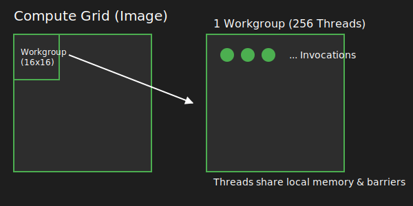

WebGPU is an explicit graphics and compute API. Unlike older APIs (like OpenGL) that hid memory management and scheduling behind a "black box" driver, WebGPU forces the developer to declare exactly what data goes where and when.

:::important
For a compute-focused application, you only need to understand the **Compute Pipeline**.
:::

## The Hardware Hierarchy

WebGPU maps your code to the physical GPU using a strict hierarchy of objects:

* **Instance:** The connection to the host OS and the WebGPU implementation (Google Dawn in this context).
* **Adapter:** A physical piece of hardware (e.g., "NVIDIA RTX 4090" or "Apple M2").
* **Device:** The logical connection to the Adapter. You use the Device to create buffers, textures, and shaders.
* **Queue:** The actual submission line. You record commands on the CPU and push them into the Queue for the GPU to execute asynchronously.

## The Execution Hierarchy (Workgroups)

When you dispatch a compute shader, the GPU does not run it on a single thread. It spawns thousands of threads in a structured grid.

* **Grid:** The total amount of work (e.g., calculating 1 pixel for a 1920x1080 image).
* **Workgroup:** A localized block of threads (e.g., 16x16 threads). Threads inside the same workgroup can share memory and synchronize using barriers.
* **Invocation (Thread):** A single execution of your `main()` function.

## Memory & Bind Groups

Shaders cannot magically access CPU variables. You must explicitly bind memory:

* **Buffers:** Raw arrays of bytes (`wgpu::Buffer`). Used for uniform variables (params) or large data arrays (storage).
* **Textures:** Optimized grids of pixels (`wgpu::Texture`).
* **Bind Groups:** A specific layout mapping your C++ buffers/textures to the `@binding(X)` slots in your WGSL code.
