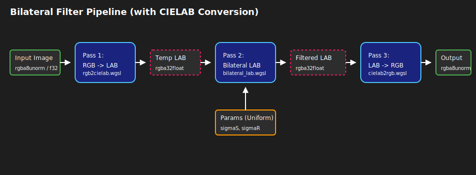

### Files
- `bilateral_filter_rgb.wgsl`
- `bilateral_filter_lab.wgsl`

## Overview

A standard Gaussian blur blurs everything, destroying sharp edges. A Bilateral Filter is an "edge-preserving blur". It looks at two weights for every neighbor pixel:

1. **Spatial Weight ($w_s$):** How far away is the neighbor? (Closer = higher weight).
2. **Range Weight ($w_r$):** How similar is the color? (Similar color = higher weight).

If a neighboring pixel is close physically but a completely different color (i.e., it is across an edge), the range weight drops to nearly 0,
preventing the colors from bleeding together.

### Weight Formula

$$w = \exp\left(-\frac{distSq}{2\sigma_{spatial}^2}\right) \times \exp\left(-\frac{rangeSq}{2\sigma_{range}^2}\right)$$

:::warning Performance Warning
The kernel radius is dynamically determined by `i32(3.0 * params.sigmaSpatial)`.
A larger spatial sigma results in an exponentially larger $O(N^2)$ nested loop per pixel.
:::

## Pipeline Visualization

