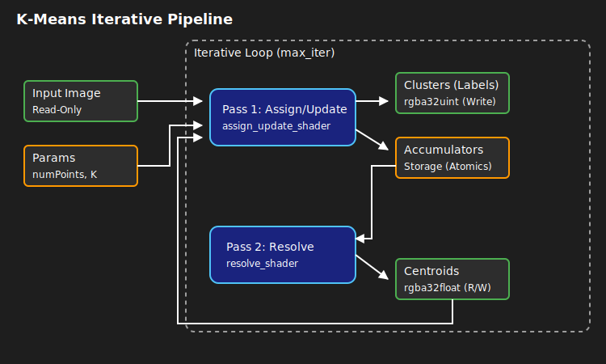

## Overview

K-Means groups pixels into $K$ distinct color clusters. It is an iterative algorithm:

1. Find the closest centroid for each pixel.
2. Average all pixels belonging to that centroid to find the new center.
3. Repeat.

## The Naive Approach vs. The Atomic Bottleneck

A naive GPU implementation (`assign_shader.wgsl` + `update_shader.wgsl`)
forces millions of threads to write to the exact same $K$ global memory slots simultaneously using `atomicAdd`.
This creates **Atomic Contention**. The GPU hardware physically locks the memory address,
forcing thousands of parallel cores to wait in a single-file line, tanking performance.

### The Optimized Approach

> **File:** `assign_update_shader.wgsl`

To bypass atomic contention, this shader introduces **Workgroup Shared Memory** (`var<workgroup>`).

#### How it works

1. The shader allocates a small, blazing-fast array (`local_sumR`, etc.) strictly for the 256 threads in the current block.
2. `workgroupBarrier()` ensures all threads wait until the first few threads have zeroed out this memory.
3. Each thread calculates its distance, and does an `atomicAdd` to the **local** array. Because only 256 threads are fighting for access (instead of 2,000,000),
it is nearly instantaneous.
4. Another `workgroupBarrier()` ensures all 256 threads are done doing math.
5. Finally, a single thread per cluster takes the sum of the entire local block and performs **one** `atomicAdd` to the global `accumulators` buffer in VRAM.

This reduces global atomic writes by a factor of 256x, transforming an algorithm that might take seconds into one that executes in milliseconds.

### The Resolve Step

> **File:** `resolve_shader.wgsl`

Once the assign/update pass finishes analyzing the whole image, the resolve shader spawns exactly $K$ threads (one for each cluster).

1. It divides the accumulated colors by the count to find the true average (the new centroid position).
2. It writes the new centroid to the `centroids` texture.
3. It resets its own global accumulator to `0` so the array is perfectly clean for the next iteration.

### Pipeline Visualization

