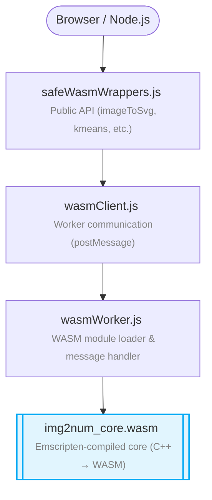

# JavaScript Binding Documentation

The JavaScript binding wraps Img2Num's WASM core in a clean, async API. It runs in browsers and Node.js.

## Architecture



Key files:

| File                  | Purpose                                                     |
| :-------------------- | :---------------------------------------------------------- |
| `safeWasmWrappers.js` | Public API — imageToSvg, bilateralFilter, kmeans, etc.      |
| `wasmClient.js`       | Worker communication layer                                  |
| `wasmWorker.js`       | WASM module loader, typed array handling, memory management |
| `index.js`            | Package exports                                             |

## WASM Memory Handling

The worker passes typed arrays between JavaScript and WASM memory via:

1. **Allocation** — `_malloc` in WASM for the buffer size.
2. **Copy** — `HEAPU8.set()` / `HEAP32.set()` depending on array type.
3. **Call** — Pass pointers to WASM function via `ccall`.
4. **Read back** — `HEAPU8.slice()` / `HEAP32.slice()` on return.
5. **Free** — `_free(ptr)` to avoid leaks.

## Worker Lifecycle

- The WASM worker is initialized on first API call (lazy loading).
- A single worker instance handles all subsequent calls.
- No external dependencies — pure JS + WASM.

## Error Handling

Errors are caught and re-thrown as:

```js
try {
  await imageToSvg({ pixels, width, height });
} catch (err) {
  console.error(err.message); // e.g. "Missing funcName", "Unsupported type"
}
```
