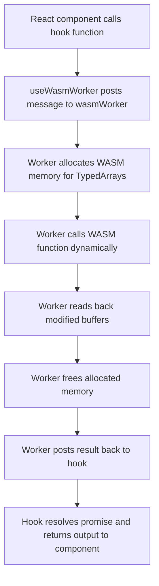

# useWasmWorker Hook

The `useWasmWorker` hook provides a **React-friendly interface** to the [**WASM Web Worker**](../../workers/wasm-worker) ([`wasmWorker.js`](https://github.com/Ryan-Millard/Img2Num/blob/main/src/workers/wasmWorker.js)).
It allows you to asynchronously invoke any **function exported by the WASM module** from your React components while keeping heavy computation off the main thread.

This hook abstracts:

- Posting messages to the worker.
- Allocating memory for `TypedArrays`.
- Calling WASM functions dynamically.
- Retrieving results.
- Cleaning up memory.

## How WASM Functions Are Exposed

All functions exported from the WASM module are available via the hook’s **generic `call` method**:

```js
const { call } = useWasmWorker();

const result = await call('myWasmFunction', { arg1, arg2 }, ['arg1', 'arg2']);
````

* `'myWasmFunction'` is the **exact name of the C++ function** (without the `_` prefix added by Emscripten internally).
* The **second argument** is an object mapping argument names to values.

  * For TypedArrays (e.g., `Uint8ClampedArray`, `Int32Array`), the corresponding keys should be included in the **`bufferKeys` array** (third argument).
* The **order of arguments in the object must match the order in the C++ function signature**. WASM functions are strict about argument order.

### Example

C++ function:

```cpp
void add_arrays(int* a, int* b, int* out, int length);
```

Calling from React:

```js
const result = await call(
  'add_arrays',           // must match the function's name
  {
    a: arrayA,            // must match the first argument
    b: arrayB,            // must match the second argument
    out: outputArray,     // must match the third argument
    length: arrayA.length // must match the last argument
  },
  ['a', 'b', 'out'] // keys that are TypedArrays (pointers)
);
```

## Adding New WASM Functions

import Tabs from '@theme/Tabs';
import TabItem from '@theme/TabItem';

1. **Add the function in your C++ module** and ensure it is exported in the build:
    <Tabs>
      <TabItem value="img2num-method" label="Img2Num Method (EXPORTED Macro)">
        :::tip This is the preferred method
        Use this method instead of the Emscripten method because it reduces bloat in the CMake file and minimizes boilerplate code.
        :::
        Import and use the `EXPORTED` macro from `exported.h` in your header file (make sure the function is not in a namespace):
        ```cpp
        #include "exported.h"

        EXPORTED void add_arrays(int* a, int* b, int* out, int length);
        ```
      </TabItem>

      <TabItem value="emscripten-method" label="Emscripten Method">
        :::caution Don't use this method in Img2Num!
        This method leads to bloat in the CMake file, is difficult to maintain and tough to debug.

        Use the Img2Num method instead because it provides convenience, reduces boilerplate, and saves you from numerous possible bugs.
        :::
        Add the function to the CMake file's `EXPORTED_FUNCTIONS` flag:
        ```cmake
        "SHELL:-s EXPORTED_FUNCTIONS=['_malloc','_free','_add_arrays']"
        ```
      </TabItem>
    </Tabs>

2. **Call it via the hook** using the `call` method, providing:
   * An object mapping argument names to values **in the same order as the C++ function signature**.
   * A `bufferKeys` array for all `TypedArrays` (pointers) that need WASM memory allocation.

3. The hook will handle:
   * Allocating WASM memory.
   * Copying TypedArrays into WASM memory.
   * Calling the function.
   * Copying modified buffers back.
   * Freeing WASM memory.

## Potential Pitfalls

### 1. Incorrect Argument Order

WASM functions **require arguments to be in the exact order declared in C++**.
Passing an object with keys in the wrong order may result in unexpected behavior or crashes.

```js title="❌ Wrong order"
await call('add_arrays', { b: arrayB, a: arrayA, out: outputArray, length: arrayA.length }, ['a','b','out']);
```
```js title="✅ Correct order"
await call('add_arrays', { a: arrayA, b: arrayB, out: outputArray, length: arrayA.length }, ['a','b','out']);
```

### 2. Missing TypedArray Keys

All TypedArrays that are modified by the WASM function **must be included in `bufferKeys`**.
Otherwise, the worker will treat them as simple values, and the function may crash or produce invalid output.

### 3. Worker Not Initialized

Always ensure the WASM worker is **fully initialized** before calling any function.
`useWasmWorker` handles this internally, but calling functions **immediately on render without waiting for the hook** may fail.

### 4. Adding New TypedArray Types

If you want to pass a new TypedArray type (e.g., `Float32Array`), you must:

1. Add support in `wasmWorker.js` for copying the new type into WASM memory.
2. Ensure the corresponding **HEAP view** is exported from the C++ module in `EXPORTED_RUNTIME_METHODS` in the CMake file.

:::tip
See the [documentation for `wasmWorker.js`](../../workers/wasm-worker/) before adding new types.
:::

### 5. Memory Management

* The hook and worker automatically allocate and free WASM memory for TypedArrays.
* Avoid manually managing WASM pointers outside this mechanism to prevent memory leaks or crashes.

## Diagram: React → Worker → WASM Flow



* Demonstrates the **end-to-end flow** of calling any WASM function via the hook.

## Summary

* `useWasmWorker` exposes **all WASM functions dynamically** through the generic `call` method.
* TypedArrays must be specified in `bufferKeys` and argument **order must match C++ signature**.
* New functions require both **C++ export** and proper handling in `wasmWorker.js`.
* Handles memory allocation, result copying, and cleanup automatically.
* Provides safe, asynchronous access to WASM from React.
