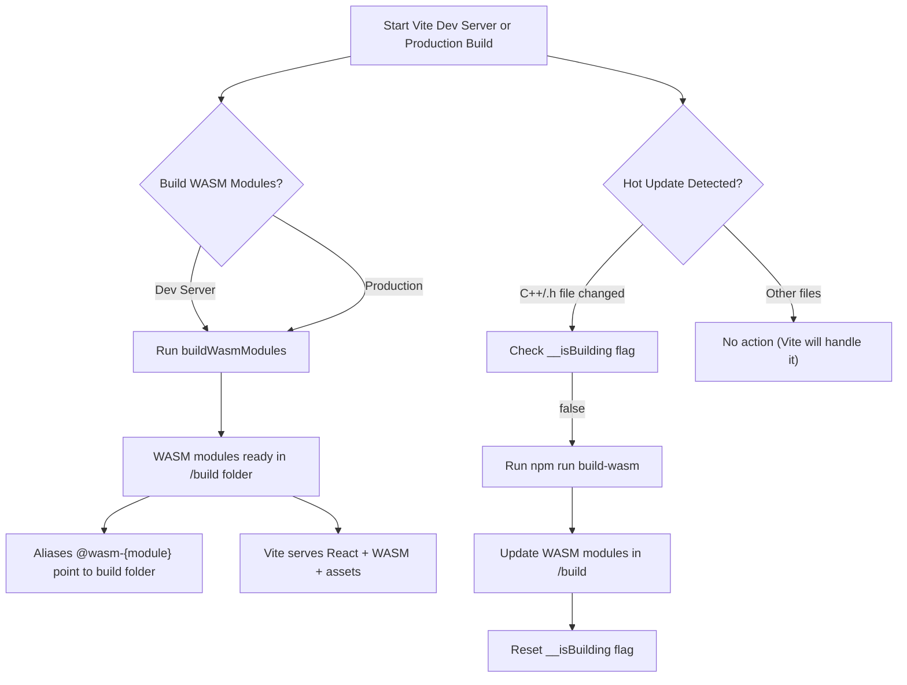

This file defines the Vite configuration for the **Img2Num** project. It handles React setup, WebAssembly modules, sitemap generation, and custom build workflows. The configuration ensures smooth development and production environments.

## Imports

|                             Import | Explanation                                                           |
| ---------------------------------: | --------------------------------------------------------------------- |
|                     `defineConfig` | Helper for strongly typed Vite configuration.                         |
|                            `react` | React plugin using SWC for faster builds.                             |
|                             `exec` | Node.js method to run shell commands, used for building WASM modules. |
|                             `path` | Node.js path utility.                                                 |
|                   `fast-glob (fg)` | Glob pattern matching for adding custom files to the watcher.         |
|                               `fs` | Node.js filesystem API.                                               |
|                        `promisify` | Converts callback-based functions to promises for `async/await`.      |
|                       `imagetools` | Vite plugin for on-the-fly image transformations.                     |
| `generateContributorCreditsPlugin` | Custom plugin that generates contributor credits JSON.                |
|                `VitePluginSitemap` | Generates sitemap for SEO and deployment to GitHub Pages.             |

## Utility Functions

### `generateWasmAliases()`

```javascript
function generateWasmAliases() {
  const modulesPath = path.resolve(__dirname, 'src/wasm/modules');
  const moduleNames = fs
    .readdirSync(modulesPath)
    .filter((name) => fs.statSync(path.join(modulesPath, name)).isDirectory());
  const aliases = {};
  moduleNames.forEach((name) => {
    aliases[`@wasm-${name}`] = path.join(modulesPath, name, 'build');
    console.log(`Found wasm module: ${name}`);
  });
  return aliases;
}
```

- Dynamically creates module aliases for all WASM modules in `src/wasm/modules`.
- Example: `@wasm-image` → `src/wasm/modules/image/build`.
- Allows importing WASM modules in JS/TS files using concise aliases.

### `buildWasmModules()`

```javascript
async function buildWasmModules() {
  console.log('🔨 Building WASM modules on startup...');
  try {
    const { stdout, stderr } = await execAsync('npm run build-wasm');
    console.log('✅ WASM modules built successfully');
    if (stdout) console.log('Build output:', stdout);
    if (stderr) console.log('Build warnings:', stderr);
  } catch (error) {
    console.error('❌ Failed to build WASM modules:', error.message);
    console.error('Make sure you have emscripten installed and npm run build-wasm is configured');
  }
}
```

- Executes `npm run build-wasm` asynchronously.
- Logs build output and warnings.
- Provides instructions if the build fails.
- Ensures WASM modules are ready before development or production builds.

## Vite Configuration

<details>
<summary>View Code</summary>
```javascript
export default defineConfig({
  base: '/Img2Num/', // important for GitHub Pages
  server: {
    host: '0.0.0.0', // Allow connections from outside Docker
    port: 5173, // Match docker-compose port
    watch: {
      ignored: ['**/docs/**', 'src/wasm/**/*.js', 'src/wasm/**/*.wasm'],
    },
  },
  assetsInclude: ['**/*.wasm'], // Ensure Vite copies .wasm files
  resolve: {
    alias: {
      '@pages': path.resolve(__dirname, 'src/pages'),
      '@assets': path.resolve(__dirname, 'src/assets'),
      '@components': path.resolve(__dirname, 'src/components'),
      '@utils': path.resolve(__dirname, 'src/utils'),
      '@hooks': path.resolve(__dirname, 'src/hooks'),
      '@workers': path.resolve(__dirname, 'src/workers'),
      '@global-styles': path.resolve(__dirname, 'src/global-styles'),
      '@data': path.resolve(__dirname, 'src/data'),
      ...generateWasmAliases(),
    },
  },
  plugins: [
    react(),
    imagetools(),
    VitePluginSitemap({
      hostname: 'https://ryan-millard.github.io/Img2Num',
      dynamicRoutes: ['/', '/credits'],
    }),
    generateContributorCreditsPlugin(),
    ...
  ],
});
```
</details>

### Base URL

```javascript
base: '/Img2Num/';
```

- Necessary for deploying the project to GitHub Pages.
- All paths will be resolved relative to `/Img2Num/`.

### Server Options

```javascript
server: {
  host: '0.0.0.0',
  port: 5173,
  watch: {
    ignored: ['**/docs/**', 'src/wasm/**/*.js', 'src/wasm/**/*.wasm'],
  },
},
```

- `host: '0.0.0.0'` allows connections from external devices (useful in Docker).
- `port: 5173` matches the Docker Compose and default configuration (explicit for Docker).
- `watch.ignored` prevents Vite from watching unnecessary files, improving performance.

### Assets Include

```javascript
assetsInclude: ['**/*.wasm'];
```

- Ensures `.wasm` files are copied to the build output.
- Necessary because WASM files are loaded at runtime.

### Module Aliases

Provides shorthand imports across the project:

```js
import MyComponent from '@components/MyComponent'; // imports MyComponent from /src/components/MyComponent
import processWasm from '@wasm-image'; // imports WASM code from /src/wasm/modules/image/build
```

### Plugins

#### React SWC Plugin

```javascript
react();
```

- Provides fast JSX/TSX compilation with SWC.
- Replaces slower Babel-based React plugin.

#### Image Tools

```javascript
imagetools();
```

- Allows importing images with transformations directly in code.
- Example: resizing, format conversion, or optimization at build time.

#### Sitemap

```javascript
VitePluginSitemap({
  hostname: 'https://ryan-millard.github.io/Img2Num',
  dynamicRoutes: ['/', '/credits'],
});
```

- Automatically generates `sitemap.xml` for SEO and GitHub Pages.
- Supports dynamic routes.

#### Contributor Credits Generator

```javascript
generateContributorCreditsPlugin();
```

- Custom plugin that scans the repo and generates a JSON file listing contributors.
- Useful for `/credits` page or open-source acknowledgments.

#### WASM Build on Startup

```javascript
{
  name: 'build-wasm-on-startup',
  async buildStart() {
    if (process.env.NODE_ENV === 'production') {
      await buildWasmModules();
    }
  },
  async configureServer() {
    await buildWasmModules();
  },
}
```

- Builds all WASM modules at the start of development or production build.
- Ensures WASM modules are always up-to-date before usage.

#### Watch C++ and Build WASM

```javascript
{
  name: 'watch-cpp-and-build-wasm',
  __isBuilding: false,
  handleHotUpdate({ file }) {
    if ((file.endsWith('.cpp') || file.endsWith('.h')) && !this.__isBuilding) {
      this.__isBuilding = true;
      exec('npm run build-wasm', (err, stdout, stderr) => {
        this.__isBuilding = false;
        ...
      });
    }
  },
  configureServer(server) {
    const files = fg.sync('src/wasm/**/*.{cpp,h}').map((f) => path.resolve(f));
    files.forEach((file) => server.watcher.add(file));
  },
}
```

- Watches all `.cpp` and `.h` files for changes.
- Automatically rebuilds WASM modules when C++ source files are modified.
- Prevents simultaneous builds with `__isBuilding` flag.
- Adds all WASM source files to Vite’s watcher manually.

This configuration ensures:

- Efficient development with hot reloading of WASM modules.
- Optimized production builds with prebuilt WASM modules.
- Easy imports using aliases for React components, hooks, utils, and WASM modules.
- Automatic sitemap generation and contributor credit management.

### WASM Build/Watch Flow

The following diagram illustrates how Vite interacts with WASM modules during development and production builds:


