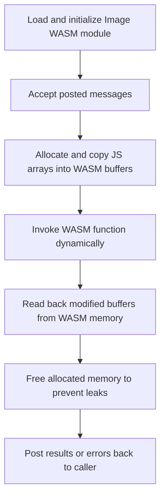

[`wasmWorker.js`](https://github.com/Ryan-Millard/Img2Num/tree/main/src/workers/wasmWorker.js) defines a
**Web Worker** that bridges between JavaScript and the **Image WASM module**.

It allows expensive WASM computations to run independently from the main thread, improving UI performance.

:::tip JS-to-WASM Memory
All data is copied between JavaScript and WASM - this avoids unexpected use-after-free bugs in JS.

| Language   | Memory type                    | Data supplier                                                                                                                                        | Who manages it                |
| ---------- | ------------------------------ | ---------------------------------------------------------------------------------------------------------------------------------------------------- | ----------------------------- |
| JavaScript | Detached Copy of WASM data     | [`wasmWorker.js`](https://github.com/Ryan-Millard/Img2Num/tree/main/src/workers/wasmWorker.js): copies return & out parameter values to JS variables | Garbage Collector (automatic) |
| WASM (C++) | Linear Independent WASM memory | [`wasmWorker.js`](https://github.com/Ryan-Millard/Img2Num/tree/main/src/workers/wasmWorker.js): copies args & bufferKeys to WASM memory              | Programmer (manual)           |

:::

## Overview

### Key responsibilities

import Tabs from '@theme/Tabs';
import TabItem from '@theme/TabItem';

<Tabs groupId="wasm-worker" defaultValue="flow">
<TabItem value="flow" label="Flow diagram">

<div>



</div>

</TabItem>

<TabItem value="overview" label="Overview">

- Load and initialize the **Image WASM module**.
- Accept messages from the main thread describing:
  - The function to call in WASM.
  - Arguments to pass, including TypedArrays.
- Allocate and copy memory for JS arrays into WASM.
- Invoke the WASM function dynamically.
- Read back any modified buffers from WASM memory.
- Free allocated memory to prevent leaks.
  - This keeps the code written in JavaScript looking more like JavaScript and prevents forgotten memory frees.
- Post results or errors back to the main thread.

</TabItem>
</Tabs>

## TypedArray and Value Handling (`WASM_TYPES`)

```js title="The worker uses a centralized type registry to handle allocation and readback consistently:"
const WASM_TYPES = {
  void: {},

  Int32Array: {
    alloc: (arr) => {
      const ptr = wasmModule._malloc(arr.byteLength);
      wasmModule.HEAP32.set(arr, ptr / 4);
      return ptr;
    },
    read: (ptr, length) => new Int32Array(wasmModule.HEAP32.buffer, ptr, length).slice(),
  },

  Uint8Array: {
    alloc: (arr) => {
      const ptr = wasmModule._malloc(arr.byteLength);
      wasmModule.HEAPU8.set(arr, ptr);
      return ptr;
    },
    read: (ptr, length) => new Uint8Array(wasmModule.HEAPU8.subarray(ptr, ptr + length)).slice(),
  },

  Uint8ClampedArray: {
    alloc: (arr) => {
      const ptr = wasmModule._malloc(arr.byteLength);
      wasmModule.HEAPU8.set(arr, ptr);
      return ptr;
    },
    read: (ptr, length) => new Uint8ClampedArray(wasmModule.HEAPU8.subarray(ptr, ptr + length)).slice(),
  },

  string: {
    alloc: (str) => {
      const len = wasmModule.lengthBytesUTF8(str) + 1;
      const ptr = wasmModule._malloc(len);
      wasmModule.stringToUTF8(str, ptr, len);
      return ptr;
    },
    read: (ptr) => wasmModule.UTF8ToString(ptr),
  },
};
```

### Why this design?

- One authoritative place for allocation and readback logic
- Easy to add new types safely
- Prevents mismatched heap usage
- Keeps JS-side code declarative
  - TypeScript offers limited benefit here: all values decay to raw pointers and integers at the C ABI boundary, so runtime handling must be explicit.

:::danger Danger: Adding New WASM_TYPES
Memory received from WASM is raw and untyped. Returned values are typically integers (often pointers) and must be interpreted explicitly.

See the [Adding New WASM_TYPES](#adding-new-wasm_types) section below to learn how to read new types safely.
:::

## Memory Allocation for Arguments and Out Parameters

### Optional Buffer Keys

Messages **optionally** specify bufferKeys as structured descriptors:

```js title="Arguments passed to WASM function"
args: {
  (pixels, labels, width, height, min_area, draw_contour_borders);
}
```

```js title="Arguments that represent buffers (C++ arrays)"
bufferKeys: [
  { key: 'pixels', type: 'Uint8ClampedArray' },
  { key: 'labels', type: 'Int32Array' },
];
```

:::important
The `key` values in `bufferKeys` must exactly match the name of the argument given in JS.

> The names given to `args` do not need to match the names in the definition of the C++ function.
> :::

### Allocation Flow

```js title="Loop over bufferKeys"
bufferKeys?.forEach(({ key, type }) => {
  const ptr = WASM_TYPES[type].alloc(args[key]);
  pointers[key] = { ptr, type, length: args[key].length };
  args[key] = ptr;
});
```

- Allocates memory via `_malloc`
- Copies JS data into the correct WASM heap
- Replaces JS values with raw pointers
- Tracks all allocations for guaranteed cleanup
  - Memory freed in `finally` block

## Dynamic WASM Function Call

```js title="Dynamic lookup & invocation"
const exportName = `_${funcName}`;
if (typeof wasmModule[exportName] !== 'function') throw new Error(`Export not found: ${exportName}`);
const result = wasmModule[exportName](...Object.values(args ?? {}));
```

- All Emscripten exports are prefixed with `_`.
  - We add the prefix in the API for the caller's convenience because it is easy to forget.
- **Dynamic lookup** allows calling any exported function.
- Arguments must match the **exact C++ signature order**.
- `Object.values(args)` relies on property insertion order; callers must construct `args` in the exact order expected by the C++ signature.

## Reading Back Buffers and Return Values

**Example `WASM_TYPE`** (for reference):

```js
Int32Array: {
  alloc: (arr) => {
    const ptr = wasmModule._malloc(arr.byteLength);
    wasmModule.HEAP32.set(arr, ptr / 4);
    return ptr;
  },
  read: (ptr, length) => new Int32Array(wasmModule.HEAP32.buffer, ptr, length).slice(),
}
```

- `.slice()` ensures the data is detached from WASM memory.
- JS always receives GC-managed copies

### Buffers (Out Parameters)

```js title="Suppose bufferKey[i].type = Int32Array"
bufferKeys?.forEach(({ key, type }) => {
  output[key] = WASM_TYPES[type].read(pointers[key].ptr, pointers[key].length);
});
```

### Returned Values

```js title="Suppose returnType = Int32Array:"
if (returnType && WASM_TYPES[returnType] !== WASM_TYPES.void) {
  returnValue = WASM_TYPES[returnType].read(result);
}
```

## Guaranteed Memory Cleanup

```js title="Free pointers we previously allocated from WASM memory"
finally {
  for (const { ptr } of Object.values(pointers)) {
    wasmModule._free(ptr);
  }
}
```

- Memory is always freed, even on exceptions.
- Safe for long-running workers.
- Prevents silent WASM heap growth.

## Adding New `WASM_TYPES`

Any new TypedArray types must be added to the `WASM_TYPES` object
and their corresponding Emscripten-provided views to the **EXPORTED_RUNTIME_METHODS** flag in the C++ module's CMake build file.

For example, an `Int32Array` cannot be read if `HEAP32` is not exported from WASM.

This means that it needs to be exported explicitly in the CMake file's flags:

```CMakeLists.txt
"SHELL:-s EXPORTED_RUNTIME_METHODS=['HEAP32']"
```

## Notes

- Always add **new TypedArray types** in both:
  1. This worker file (`wasmWorker.js`).
  2. The Emscripten module’s `EXPORTED_RUNTIME_METHODS` in CMake (add the corresponding view to this flag).

- Avoid calling WASM functions before the module is fully initialized.
- Use **`bufferKeys`** to specify which arguments are arrays needing memory allocation.
