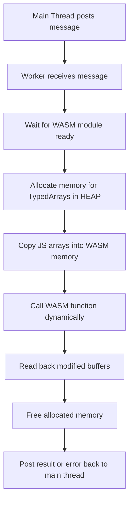

This file implements a **Web Worker** that acts as a bridge between JavaScript and the **Image WASM module**.
It handles **memory allocation**, **TypedArray mapping**, **dynamic function calls**, and **returning results or errors** asynchronously.

This allows expensive WASM computations to run independently from the main thread, improving UI performance.

:::tip JS-to-WASM Memory
To ensure safety and proper memory management, all data is copied between JavaScript and WASM.

- JavaScript receives a **detached copy**, allowing its garbage collector (GC) to clean up unused objects.
- WASM manages its own memory independently, preventing accidental overwrites or leaks.

This pattern avoids bugs that could occur if JS arrays directly referenced WASM memory that gets freed.
:::

## Overview

### Key responsibilities

- Load and initialize the **Image WASM module**.
- Accept messages from the main thread describing:
  - The function to call in WASM.
  - Arguments to pass (including TypedArrays).
- Allocate and copy memory for JS arrays into WASM.
- Invoke the WASM function dynamically.
- Read back any modified buffers from WASM memory.
- Free allocated memory to prevent leaks.
  - This keeps the code written in JavaScript looking more like JavaScript and prevents forgotten memory frees.
- Post results or errors back to the main thread.

## WASM Module Initialization

```js
import createImageModule from "@wasm-image";

let wasmModule;
let readyResolve;
const readyPromise = new Promise((res) => (readyResolve = res));

// Initialize the module once
createImageModule().then((mod) => {
  wasmModule = mod;
  readyResolve();
});
```

- Imports the `createImageModule` factory function generated by **Emscripten**.
- Uses a **Promise** (`readyPromise`) to ensure the module is fully loaded before handling any messages.
- Initialization only happens once.

## Message Handling

```js
self.onmessage = async ({ data }) => {
  await readyPromise;

  const { id, funcName, args, bufferKeys } = data;
  const pointers = Object.create(null); // Track malloc pointers
  try {
    // Allocate buffers for Array payloads
    ...
```

- The worker listens to `self.onmessage` from the main thread.
- Each message should contain:
  - `id`: Unique identifier for correlating responses.
  - `funcName`: WASM function to call.
  - `args`: Object containing arguments.
  - `bufferKeys` (optional): Keys in `args` that are TypedArrays and require special WASM memory mapping.

- The worker waits for the WASM module to be **ready** before proceeding.

## Memory Allocation for TypedArrays

```js
if (bufferKeys) {
  for (const key of bufferKeys) {
    const arr = args[key];
    const sizeInBytes = arr.byteLength;
    const ptr = wasmModule._malloc(sizeInBytes);

    if (arr instanceof Int32Array) {
      wasmModule.HEAP32.set(arr, ptr / Int32Array.BYTES_PER_ELEMENT);
    } else if (arr instanceof Uint8ClampedArray || arr instanceof Uint8Array) {
      wasmModule.HEAPU8.set(arr, ptr);
    } else {
      throw new Error(`Unsupported TypedArray type for key: ${key}`);
    }

    pointers[key] = { ptr, sizeInBytes, type: arr.constructor };
    args[key] = ptr; // pass pointer to WASM
  }
}
```

- For each buffer key:
  1. Allocate memory in WASM using `_malloc` (C-style code applies here for interoperability, this is why the `new` keyword from C++ is not used).
  2. Copy the JS array into the appropriate **HEAP view**:
     - `Int32Array` → `HEAP32`
     - `Uint8ClampedArray` → `HEAPU8`
     - `Uint8Array` → `HEAPU8`
  3. Replace the JS array in `args` with the pointer.
  4. Track allocation for later cleanup.

:::danger Danger: New TypedArray Types
Any new TypedArray types must be added to this section and their corresponding **EXPORTED_RUNTIME_METHODS** in the C++ module's CMake build file.

For example, an `Int32Array` cannot be read if `HEAP32` is not exported from WASM. This means that it needs to be exported explicitly in the CMake file.
:::

## Dynamic WASM Function Call

```js
const exportName = `_${funcName}`;
if (typeof wasmModule[exportName] !== "function") {
  throw new Error(`WASM export not found: ${exportName}`);
}

const targetFunction = wasmModule[exportName];
const targetFunctionArgs = funcName && args ? Object.values(args) : [];
const result = targetFunction(...targetFunctionArgs);
```

- All Emscripten exports are prefixed with `_`.
  - We add the prefix in the API for the caller's convenience because it is easy to forget.
- Uses **dynamic lookup** so any exported function can be called.
- Arguments are passed as an **array of values or pointers**.

## Reading Back Modified Buffers

```js
const outputs = {};
if (bufferKeys) {
  for (const key of bufferKeys) {
    const { ptr, sizeInBytes, type } = pointers[key];
    if (type === Int32Array) {
      outputs[key] = new Int32Array(wasmModule.HEAP32.buffer, ptr, sizeInBytes / Int32Array.BYTES_PER_ELEMENT).slice();
    } else if (type === Uint8ClampedArray) {
      outputs[key] = new Uint8ClampedArray(wasmModule.HEAPU8.subarray(ptr, ptr + sizeInBytes)).slice();
    } else if (type === Uint8Array) {
      outputs[key] = new Uint8Array(wasmModule.HEAPU8.subarray(ptr, ptr + sizeInBytes)).slice();
    }
  }
}
```

- After the function call, reads back any modified arrays.
- Uses `.slice()` to detach from WASM memory.
- Ensures main thread receives **independent copies**.

## Memory Cleanup

```js
finally {
  for (const { ptr } of Object.values(pointers)) {
    wasmModule._free(ptr);
  }
}
```

- Always frees allocated memory with `_free`.
- Prevents memory leaks in long-running workers.

## Posting Results Back

```js
self.postMessage({ id, output: outputs, returnValue: result });
```

- Returns both:
  - `returnValue`: the function’s direct return value.
  - `output`: object containing updated TypedArrays.

- If any error occurs, it posts back:

```js
self.postMessage({ id, error: error.message });
```

## Diagram (WASM Worker Flow)



- Shows the **end-to-end flow** of handling a message:
  - JS array → WASM memory → function call → output → free memory → return to main thread.

:::info Notes for Developers

- Always add **new TypedArray types** in both:
  1. This worker file (`wasmWorker.js`).
  2. The Emscripten module’s `EXPORTED_RUNTIME_METHODS` in CMake.

- Avoid calling WASM functions before the module is fully initialized.
- Use **`bufferKeys`** to specify which arguments are arrays needing memory allocation.
  :::
