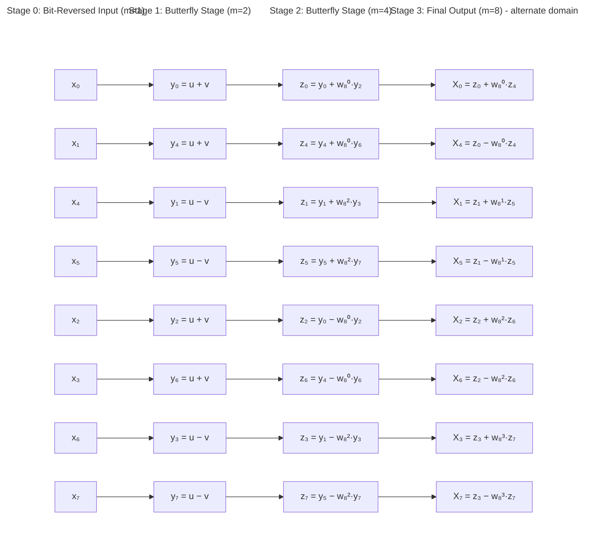

# FFT — Iterative Implementation Explained

This section explains the inner workings of the **iterative FFT** used in this project. It assumes you already understand Fourier theory, the DFT,
and complex numbers (if not, see the [prerequisite theory](../prerequisite-theory)).
Here we focus on **how the code works**, why each step is necessary, and why it was implemented in the way it was.

## Overview

The **iterative FFT** is an implementation of the Cooley–Tukey FFT algorithm that:

- Avoids recursion (unlike classic divide-and-conquer recursive FFT).
- Computes an $N$-point DFT in $O(N \log N)$ time.
- Uses in-place updates to minimize memory allocations.

**High-level steps:**

1. Reorder input array using **bit-reversal permutation**.
2. Iteratively apply **butterfly operations** across $\log_2(N)$ stages.
3. Multiply by **twiddle factors** ($e^{\pm \frac{2\pi i k}{N}}$) to combine sub-DFTs.
4. Normalize for the inverse FFT.

## Iterative FFT vs Recursive FFT

| Feature                   | Recursive FFT                        | Iterative FFT                     | Winner        | Reason                              |
| ------------------------- | ------------------------------------ | --------------------------------- | ------------- | ----------------------------------- |
| **Memory usage**          | $O(N \cdot log(N))$ call stack       | $O(N)$ in-place                   | Iterative FFT | Faster                              |
| **Function calls**        | Recursive function calls             | Simple loop over stages           | Iterative FFT | Simpler Stack Management            |
| **Performance**           | Extra overhead due to recursion      | Slightly faster, cache-friendly   | Iterative FFT | One function call, so less overhead |
| **Ease of understanding** | Conceptually simple                  | Slightly more complex indexing    | Recursive FFT | No need to understand many loops    |
| **Flexibility**           | Easy to visualize divide-and-conquer | Better for repeated or large FFTs | Tie           | Pros & Cons to both                 |

The iterative approach is chosen here for **performance and low memory overhead**, especially important when processing on devices with limited resources.
An example: a cellphone from 2013.

## Bit-Reversal Permutation

### Purpose

Before applying the iterative butterfly operations, the input array must be **reordered so that the indices correspond to the bit-reversed order**
of their original index.

- **Example:** For $N=8$, binary indices:

  | Original Index (decimal) | Original Index (binary) | Bit-Reversed Index (binary) | Bit-Reversed Index (decimal) |
  | ------------------------ | ----------------------- | --------------------------- | ---------------------------- |
  | 0                        | 000                     | 000                         | 0                            |
  | 1                        | 001                     | 100                         | 4                            |
  | 2                        | 010                     | 010                         | 2                            |
  | 3                        | 011                     | 110                         | 6                            |
  | 4                        | 100                     | 001                         | 1                            |
  | 5                        | 101                     | 101                         | 5                            |
  | 6                        | 110                     | 011                         | 3                            |
  | 7                        | 111                     | 111                         | 7                            |

- Reordering ensures that the iterative algorithm can **process butterflies in a linear pass** without recursion.
- Each butterfly stage combines elements separated by certain distances; bit-reversal guarantees that the data for each stage are contiguous in memory.

### Why it matters

Without bit-reversal, iterative FFT cannot correctly combine the sub-transforms, and the resulting frequency spectrum would be scrambled.

:::note
Bit-reversal effectively separates and reorders the data in a way similar to the even/odd splitting in the recursive DFT,
allowing the iterative FFT to combine sub-transforms efficiently.
:::

## Butterfly Operations

:::important
A **butterfly** is the core computation of the FFT.
:::

Given two inputs $u$ and $v$:

$$
\begin{align*}
y_0 &= u + w \cdot v \quad \text{where $w$ is a twiddle factor } (e^{\pm \frac{2\pi i k}{N}}) \\
y_1 &= u - w \cdot v
\end{align*}
$$

### Explanation

- Each butterfly combines two elements from a smaller DFT to form part of a larger DFT.
- At stage $s$ of the FFT:
  - Each group has size $m = 2^s$.
  - Half of the elements are combined with the other half using the corresponding twiddle factor.

### Visualization

