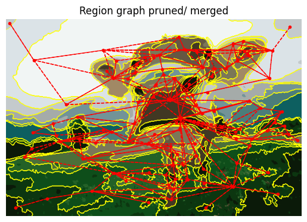
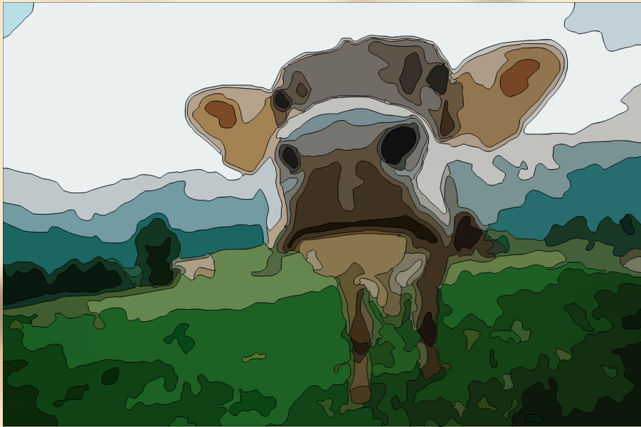

To explain Graph creation from image regions we show a diagram representation followed by a concrete step-by-step example.

## Mapping Images to Graphs

Assume a region partition image as shown. Each partition (and the pixels contained within) are represented as a Node. Nodes exist in the heap. A Graph is a collection of shared pointers to these Nodes (`std::unique_ptr<std::vector<std::shared_ptr<Node>>>`). A Graph has unique ownership over these Nodes pointers.


_Figure 1: Partitioned Image_

Below is a visualization of the Graph with its connections forming a undirected graph (a). In reality each `Node` contains a list of pointers to their neighbors, represented as edges (b). Note that adjacent nodes point to each other. Edge management is handled by the Graph.

_Figure 2: Visualizing a Graph. Note in (b) only 3 nodes are displayed 0,1,3. The remaining nodes have a similar structure_

## Small Area Node Merging (Small Region Pruning)

One of the Graph's main operations is Node merging. Suppose we want to absorb/merge region 0 (Node 0) into region 2 (Node 2). Node 2 will assume ownership of Nodes 0's pixels and neighbors. The following figure shows the step-by-step process that happens in Graph.


_Figure 3: Step-by-step visualization of node merging_

**a**. Consider merging Node 0 into Node 2

**b**. Disconnect edges to Node 0 neighbors. This requires iterating over Nodes 1, 2, and 3, and removing Node 0 from their edge set.

**c**. Transferring edges to absorbing node (Node 2). Again, iterate over Nodes 1 and 3 to assign Node 2 as an edge. Similarily Node 2 adds Node 1 and 3 as edges. In this case Node 2 and Node 3 already share an edge, but Node 1 gets a new edge.

**d**. Pixels owned by Node 0 are passed to Node 2. Node 0 is removed from the graph.

**e**. In image space, Node 2 (region 2) now contains the area that used to be Node 0's.

## Example

1. Consider starting from an image (after bilateral-filtering).


We use KMeans or a similar method to generate initial regions. But these regions do not have unique identifiers. \
Notice also that there are many tiny regions caused by quantization noise even after filtering.


We want a smart approach to merge small regions into neighboring regions. To do this build a `Graph`.

2. Building graphs consists of 2 steps:
   - Uniquely label neighboring regions. Floodfill is used for this. This discovers connected components - each connected component becomes a `Node`

   
   - Tracking neighbors - the region labels are parsed to check for neighbors by looking at 3x3 neighborhoods. Each `Node` is updated with a list of neighbors forming an undirected graph.

   

:::note Unexpected Centroid Locations
Since many regions are concave, their centroids may appear to be lying far away, but this is correct. Centroids here are just used for visualizing the graph.
:::

3. Merging small regions

The `Graph` is parsed to locate small area nodes. Each small node is merged with a larger neighbor node by transferring its pixels and edges to the absorbing neighbor node.




4. Contour creation

Now that small nodes have been pruned, each `Node` can compute its own contour using the Suzuki-Abe method.


:::caution SVG space offset

While Suzuki-Abe contour tracing correctly captures topological data, adjacent nodes end up with contours offset by ~1 pixel when mapped to SVG coordinates.

<div align="center">
See [this PR discussion](https://github.com/Ryan-Millard/Img2Num/pull/245#issuecomment-3807553622) for details on why this happens.

</div>

:::

5. Contour Management

To solve this problem `Graph` has to overlap neighboring contours. For this `Nodes` have a special `edge_pixel` property to keep track of additional pixels to be considered for the contour. This forces neighboring contours to perfectly overlap creating no gaps or holes, which is important for SVGs.

Before gap management

<details>
<summary>Pull the code locally from PR #238</summary>
```bash
# 1. Clone the repo (if you haven't already)
git clone https://github.com/Ryan-Millard/Img2Num.git
cd Img2Num
# 2. Fetch the specific commit from the PR
git fetch origin 9eb23f9a56edaeec95e2dfcfc8389b11bfd777b6
# 3. Create a local branch pointing at it
git checkout -b try-pr-238 9eb23f9a56edaeec95e2dfcfc8389b11bfd777b6
```
</details>


After gap management


