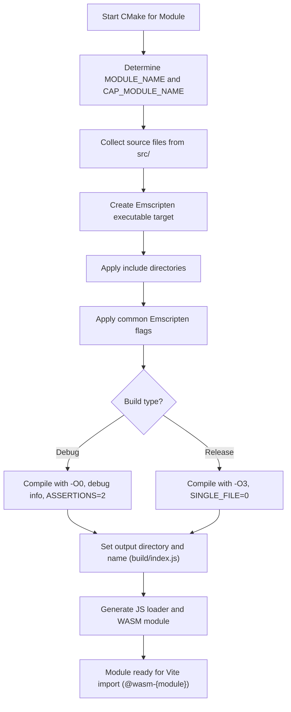

# Image Module CMake Build Configuration

This file defines the **CMake build configuration** for the image module in the **Img2Num** project.
It provides a cross-platform replacement for Makefiles and integrates with **Emscripten** to produce a `.wasm` module with a corresponding JavaScript loader.

It was introduced in [PR #93](https://github.com/Ryan-Millard/Img2Num/pull/93/changes).

## Module Name Setup

```cmake
get_filename_component(MODULE_NAME ${CMAKE_CURRENT_SOURCE_DIR} NAME)

string(SUBSTRING ${MODULE_NAME} 0 1 FIRST_LETTER)
string(TOUPPER ${FIRST_LETTER} FIRST_LETTER_UPPER)
string(SUBSTRING ${MODULE_NAME} 1 -1 REST_OF_NAME)
set(CAP_MODULE_NAME "${FIRST_LETTER_UPPER}${REST_OF_NAME}")
<<<<<<< HEAD
```

- **`MODULE_NAME`** is derived from the current directory name.
- **`CAP_MODULE_NAME`** capitalizes the first letter of the module name.
- This is used for the exported JS module name: `create{CAP_MODULE_NAME}Module`.
- Example:
  - Directory name: `image`
  - `CAP_MODULE_NAME`: `Image`
  - Export function: `createImageModule()`
=======
````

* **`MODULE_NAME`** is derived from the current directory name.
* **`CAP_MODULE_NAME`** capitalizes the first letter of the module name.
* This is used for the exported JS module name: `create{CAP_MODULE_NAME}Module`.
* Example:

  * Directory name: `image`
  * `CAP_MODULE_NAME`: `Image`
  * Export function: `createImageModule()`
>>>>>>> feat/bilater_filter_gpu

## Source Files

```cmake
file(GLOB_RECURSE SRC_FILES
    "${CMAKE_CURRENT_SOURCE_DIR}/src/*.cpp"
)
```

<<<<<<< HEAD
- Collects all C++ source files recursively from `src/`.
- Ensures that new `.cpp` files are automatically included without updating CMake manually.
=======
* Collects all C++ source files recursively from `src/`.
* Ensures that new `.cpp` files are automatically included without updating CMake manually.
>>>>>>> feat/bilater_filter_gpu

## Output Configuration

```cmake
set(BUILD_DIR "${CMAKE_CURRENT_SOURCE_DIR}/build")
set(OUT_JS "${BUILD_DIR}/index.js")
```

<<<<<<< HEAD
- **`BUILD_DIR`** is where the compiled `.wasm` and `.js` files will be placed.
- **`OUT_JS`** is the path to the generated JavaScript loader file.
=======
* **`BUILD_DIR`** is where the compiled `.wasm` and `.js` files will be placed.
* **`OUT_JS`** is the path to the generated JavaScript loader file.
>>>>>>> feat/bilater_filter_gpu

## Executable Target

```cmake
add_executable(${MODULE_NAME}_wasm ${SRC_FILES})
```

<<<<<<< HEAD
- Creates an **Emscripten executable target** that produces both `.wasm` and `.js`.
- The target is named `{MODULE_NAME}_wasm`.
=======
* Creates an **Emscripten executable target** that produces both `.wasm` and `.js`.
* The target is named `{MODULE_NAME}_wasm`.
>>>>>>> feat/bilater_filter_gpu

## Include Directories

```cmake
target_include_directories(${MODULE_NAME}_wasm PRIVATE
    ${CMAKE_CURRENT_SOURCE_DIR}/include
)
```

<<<<<<< HEAD
- Adds the `include/` folder for header files.
- Only visible to this target (`PRIVATE`).
=======
* Adds the `include/` folder for header files.
* Only visible to this target (`PRIVATE`).
>>>>>>> feat/bilater_filter_gpu

## Shared Emscripten Flags

```cmake
set(COMMON_FLAGS
    "SHELL:-s MODULARIZE=1"
    "SHELL:-s EXPORT_ES6=1"
    "SHELL:-s EXIT_RUNTIME=1"
    "SHELL:-s ENVIRONMENT=web"
    "SHELL:-s EXPORTED_FUNCTIONS=['_malloc','_free']"
    "SHELL:-s EXPORTED_RUNTIME_METHODS=['ccall','cwrap','getValue','setValue','HEAPU8','HEAP32']"
    "SHELL:-s INITIAL_MEMORY=1024MB"
    "SHELL:-s MAXIMUM_MEMORY=2048MB"
    "SHELL:-s ALLOW_MEMORY_GROWTH=1"
    "SHELL:-s EXPORT_NAME=create${CAP_MODULE_NAME}Module"
)
```

<<<<<<< HEAD
- **`MODULARIZE=1`**: Wraps the module in a function instead of polluting the global scope.
- **`EXPORT_ES6=1`**: Produces ES6 module syntax for imports.
- **`EXIT_RUNTIME=1`**: Ensures runtime exits cleanly when finished.
- **`ENVIRONMENT=web`**: Targets browser environment.
- **`EXPORTED_FUNCTIONS`**: Functions accessible from JS (`_malloc`, `_free`).
- **`EXPORTED_RUNTIME_METHODS`**: Provides Emscripten utilities like `ccall`, `cwrap`, and memory views.
- **Memory settings**:
  - Initial: 1 GB
  - Max: 2 GB
  - Memory growth allowed

- **`EXPORT_NAME`**: JS module factory function, e.g., `createImageModule`.
=======
* **`MODULARIZE=1`**: Wraps the module in a function instead of polluting the global scope.
* **`EXPORT_ES6=1`**: Produces ES6 module syntax for imports.
* **`EXIT_RUNTIME=1`**: Ensures runtime exits cleanly when finished.
* **`ENVIRONMENT=web`**: Targets browser environment.
* **`EXPORTED_FUNCTIONS`**: Functions accessible from JS (`_malloc`, `_free`).
* **`EXPORTED_RUNTIME_METHODS`**: Provides Emscripten utilities like `ccall`, `cwrap`, and memory views.
* **Memory settings**:

  * Initial: 1 GB
  * Max: 2 GB
  * Memory growth allowed
* **`EXPORT_NAME`**: JS module factory function, e.g., `createImageModule`.
>>>>>>> feat/bilater_filter_gpu

## Applying Common Flags

```cmake
target_link_options(${MODULE_NAME}_wasm PRIVATE ${COMMON_FLAGS})
```

<<<<<<< HEAD
- Applies the shared flags to the link step.
- Ensures consistent WASM output across all modules.
=======
* Applies the shared flags to the link step.
* Ensures consistent WASM output across all modules.
>>>>>>> feat/bilater_filter_gpu

## Build-Type Specific Flags

```cmake
if(CMAKE_BUILD_TYPE STREQUAL "Debug")
    target_compile_options(${MODULE_NAME}_wasm PRIVATE -O0 -g4)
    target_link_options(${MODULE_NAME}_wasm PRIVATE
        "SHELL:-s ASSERTIONS=2"
        -g4
    )
else()
    target_compile_options(${MODULE_NAME}_wasm PRIVATE -O3)
    target_link_options(${MODULE_NAME}_wasm PRIVATE
        "SHELL:-s SINGLE_FILE=0"
    )
endif()
```

<<<<<<< HEAD
- **Debug**:
  - No optimizations (`-O0`)
  - Full debug info (`-g4`)
  - Emscripten runtime assertions enabled (`ASSERTIONS=2`)

- **Release**:
  - Optimized (`-O3`)
  - `SINGLE_FILE=0` to allow separate `.js` and `.wasm` files.
=======
* **Debug**:

  * No optimizations (`-O0`)
  * Full debug info (`-g4`)
  * Emscripten runtime assertions enabled (`ASSERTIONS=2`)

* **Release**:

  * Optimized (`-O3`)
  * `SINGLE_FILE=0` to allow separate `.js` and `.wasm` files.
>>>>>>> feat/bilater_filter_gpu

This ensures **fast builds for development** and **optimized output for production**.

## Output Location and Name

```cmake
set_target_properties(${MODULE_NAME}_wasm PROPERTIES
    RUNTIME_OUTPUT_DIRECTORY "${BUILD_DIR}"
    OUTPUT_NAME "index"
    SUFFIX ".js"
)
```

<<<<<<< HEAD
- Compiled `.js` and `.wasm` files are placed in `build/`.
- JS loader is always named `index.js`.
- WASM module is automatically named `index.wasm`.
=======
* Compiled `.js` and `.wasm` files are placed in `build/`.
* JS loader is always named `index.js`.
* WASM module is automatically named `index.wasm`.
>>>>>>> feat/bilater_filter_gpu

## Summary

This CMake configuration provides a **self-contained build system for a single WASM module**:

<<<<<<< HEAD
- Automatically determines module name and export function.
- Collects all source files recursively.
- Configures Emscripten for browser-friendly ES6 modules.
- Handles memory allocation, runtime methods, and modularization.
- Supports both **Debug** and **Release** builds.
- Produces outputs compatible with **Vite** and the main Img2Num workflow.
=======
* Automatically determines module name and export function.
* Collects all source files recursively.
* Configures Emscripten for browser-friendly ES6 modules.
* Handles memory allocation, runtime methods, and modularization.
* Supports both **Debug** and **Release** builds.
* Produces outputs compatible with **Vite** and the main Img2Num workflow.
>>>>>>> feat/bilater_filter_gpu

```cmake
message(STATUS "Module '${MODULE_NAME}' configured (export: create${CAP_MODULE_NAME}Module)")
```

<<<<<<< HEAD
- Prints the module configuration at CMake configure time for developer visibility.
=======
* Prints the module configuration at CMake configure time for developer visibility.
>>>>>>> feat/bilater_filter_gpu



:::info Vite Import
See the [Vite configuration documentation](../../../../react/vite-config/) to understand how Vite imports it.
:::
