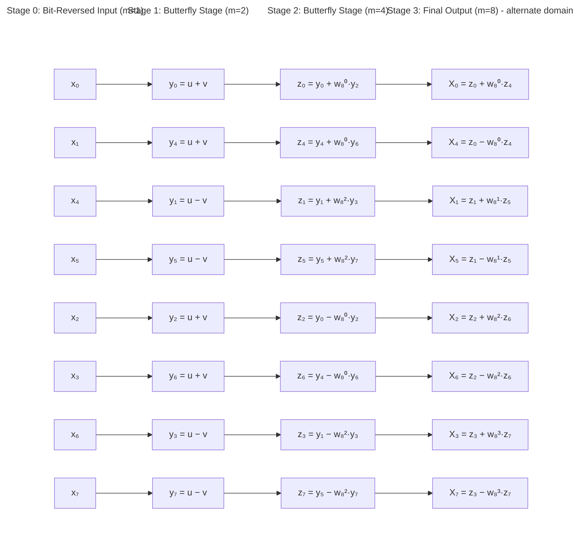

# FFT — Iterative Implementation Explained

> This document explains the inner workings of the **iterative FFT** used in this project. It assumes you already understand Fourier theory, the DFT, and complex numbers. Here we focus on **how the code works** and why each step is necessary.

# Table of Contents

1. [Overview](#1-overview)
2. [Iterative FFT vs Recursive FFT](#2-iterative-fft-vs-recursive-fft)
3. [Bit-Reversal Permutation](#3-bit-reversal-permutation)
4. [Butterfly Operations](#4-butterfly-operations)
5. [Twiddle Factors](#5-twiddle-factors)
6. [Inverse Transform and Normalization](#6-inverse-transform-and-normalization)
7. [Practical Notes / Optimizations](#7-practical-notes--optimizations)

---

# 1. Overview

The **iterative FFT** is an implementation of the Cooley-Tukey FFT algorithm that:

- Avoids recursion (unlike classic divide-and-conquer recursive FFT).
- Computes an \$N\$-point DFT in \$O(N \log N)\$ time.
- Uses in-place updates to minimize memory allocations.

**High-level steps:**

1. Reorder input array using **bit-reversal permutation**.
2. Iteratively apply **butterfly operations** across log₂(N) stages.
3. Multiply by **twiddle factors** ($$e^{\frac{-2πi k}{N}}$$) to combine sub-DFTs.
4. Normalize for the inverse FFT.

---

# 2. Iterative FFT vs Recursive FFT

| Feature                   | Recursive FFT                        | Iterative FFT                     |
| ------------------------- | ------------------------------------ | --------------------------------- |
| **Memory usage**          | O(N log N) call stack                | O(N) in-place                     |
| **Function calls**        | Recursive function calls             | Simple loop over stages           |
| **Performance**           | Extra overhead due to recursion      | Slightly faster, cache-friendly   |
| **Ease of understanding** | Conceptually simple                  | Slightly more complex indexing    |
| **Flexibility**           | Easy to visualize divide-and-conquer | Better for repeated or large FFTs |

The iterative approach is chosen here for **performance and low memory overhead**, especially important when processing many signals or images in memory.

---

# 3. Bit-Reversal Permutation

**Purpose:**

Before applying the iterative butterfly operations, the input array must be **reordered so that the indices correspond to the bit-reversed order** of their original index.

- Example: For N=8, binary indices:

| Original Index (binary) | Bit-Reversed Index (binary) | Decimal |
| ----------------------- | --------------------------- | ------- |
| 000                     | 000                         | 0       |
| 001                     | 100                         | 4       |
| 010                     | 010                         | 2       |
| 011                     | 110                         | 6       |
| 100                     | 001                         | 1       |
| 101                     | 101                         | 5       |
| 110                     | 011                         | 3       |
| 111                     | 111                         | 7       |

- Reordering ensures that the iterative algorithm can **process butterflies in a linear pass** without recursion.
- Each butterfly stage combines elements separated by certain distances; bit-reversal guarantees that the data for each stage are contiguous in memory.

**Why it matters:**

Without bit-reversal, iterative FFT cannot correctly combine the sub-transforms, and the resulting frequency spectrum would be scrambled.

> [!NOTE]
> Bit-reversal effectively separates and reorders the data in a way similar to the even/odd splitting in the recursive DFT, allowing the iterative FFT to combine sub-transforms efficiently.

---

# 4. Butterfly Operations

A **butterfly** is the core computation of the FFT:

Given two inputs `u` and `v`:

$$
y_0 = u + w \cdot v
$$

$$
y_1 = u - w \cdot v
$$

Where `w` is a **twiddle factor** ($$e^{\frac{-2πi k}{N}}$$).

**Explanation:**

- Each butterfly combines two elements from a smaller DFT to form part of a larger DFT.
- At stage `s` of the FFT:
  - Each group has size `m = 2^s`.
  - Half of the elements are combined with the other half using the corresponding twiddle factor.

**Visualization:**

- All stages are applied iteratively, doubling the sub-transform size each time.

---

# 5. Twiddle Factors

**Definition:**

Twiddle factors are complex exponentials:

$$
W_N^k = e^{-2\pi i k / N}
$$

- They encode the **phase rotation** needed to combine sub-DFTs at each stage.
- Precomputing twiddle factors per stage improves efficiency.

**Why we need them:**

- Each butterfly combines values that are separated in the original signal; the twiddle factor rotates one of the values so that they **sum correctly in the frequency domain**.
- For the inverse FFT, conjugate the twiddle factor to reverse rotation.

---

# 6. Inverse Transform and Normalization

- **Forward FFT:** no normalization (standard engineering convention).
- **Inverse FFT:** divide each element by N to recover original signal magnitude:

$$
x[n] = \frac{1}{N} \sum_{k=0}^{N-1} X[k] e^{+2 \pi i k n / N}
$$

- In code: after completing the iterative FFT with conjugated twiddle factors, scale all output values by `1/N`.

---

# 7. Practical Notes / Optimizations

1. **In-place computation** reduces memory usage and cache misses.
2. **Avoid recursion** to prevent stack overflows for large N.
3. **Stage-wise twiddle computation** allows reuse, instead of computing $$e^{\frac{-2πik}{N}}$$ every iteration.
4. **Power-of-two input length** is required for Cooley-Tukey radix-2 FFT. Zero-pad if necessary.
5. **Real-input optimization:** For purely real signals, only half the spectrum needs explicit computation (optional).
6. **2D FFTs:** Apply 1D FFT along rows, then columns (separable property).

---

**Summary of key functions in code:**

| Function / Step          | Purpose                                                       |
| ------------------------ | ------------------------------------------------------------- |
| `bit_reverse_permute(a)` | Reorders array indices to bit-reversed order.                 |
| `fft_iterative(a)`       | Computes in-place FFT via iterative stages.                   |
| `compute_twiddles(N)`    | Precomputes complex exponentials for each stage.              |
| `butterfly(u, v, w)`     | Combines two elements into a larger DFT using twiddle factor. |
| `scale_inverse(a)`       | Normalizes inverse FFT by `1/N`.                              |

---

> Iterative FFT efficiently computes the DFT using these key steps. Each step—bit-reversal, butterfly operations, and twiddle factor multiplication—corresponds directly to the mathematical structure of the Cooley-Tukey algorithm. Avoiding recursion and using in-place computation keeps it memory- and cache-efficient, which is crucial for large signals or image processing pipelines.
